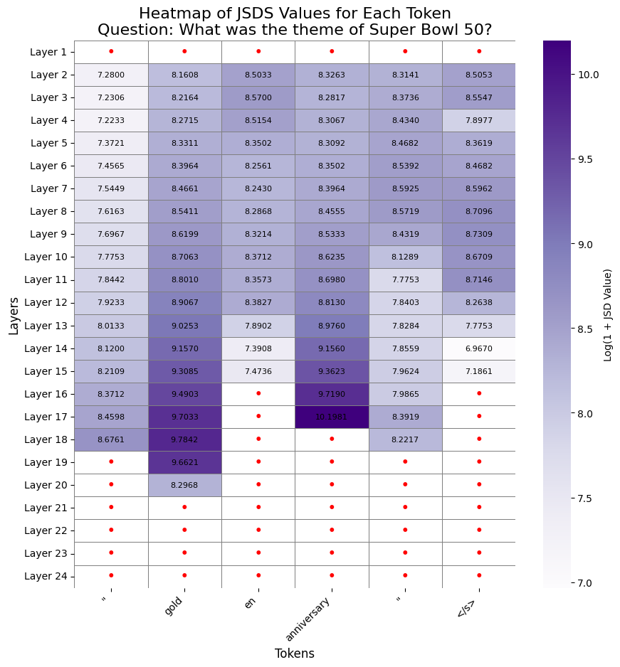
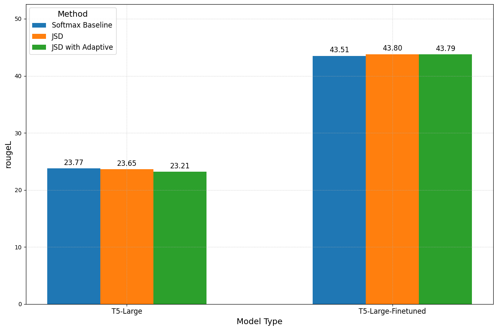

# Optimizing Predictions: Vocabulary Reduction and Contrastive Decoding in LLMs

### K.A. Abdel Sadek, G. Desimini,  M. Nulli, J. Velja, J. Vincenti
---

## Introduction

Recent advancements in Large Language Models (LLMs) have significantly improved performance across various Natural Language Processing (NLP) tasks ([Devlin et al., 2019](#bert-pre-training-2019); [Brown et al., 2020](#language-models-few-shot-2020); [Rae et al., 2021](#scaling-language-models-2021); [Smith et al., 2022](#using-deepspeed-megatron-2022); [Chowdhery et al., 2023](#palm-scaling-2023)). Efforts at improving the capabilities of these models have revolved around scaling the number of parameters and data ([Kaplan et al., 2020](#scaling-laws-2020); [Hoffmann et al., 2022](#traning-compute-optimal-2022)). However, the substantial computational load presents a practical challenge during inference, particularly in resource-constrained applications. To address this issue, Early-Exiting mechanisms ([Teerapittayanon et al., 2016](#branchynet-2016); [Schwartz et al., 2020](#right-tool-2020); [Zhu, 2021](#leebert-2021); [Simoulin & Crabbé, 2021](#model-depth-analysis-2021); [Bae et al., 2023](#fast-robust-early-exiting-2023)) have been proposed, thus reducing the inference time without significantly compromising performance. This approach is crucial because while scaling model architectures is beneficial during training, the same amout of compute may not be necessary at inference time for every input, especially for simpler tasks ([Geva et al., 2021](#transformer-key-value-memories-2021); [2022](#transformer-promoting-concepts-2022)). By enabling intermediate layer decoding, Early Exiting offers a promising solution to balance computational efficiency and model accuracy, ensuring that LLMs remain practical and effective in diverse application scenarios.

<!--
Concretely, we assume we are given a set $S := \{\{P_i\}^n_{i=1} \in \mathcal{P}^n\}$ of independent and identically distributed (i.i.d.) prompts, each belonging to different tasks (summarization, machine translation, question-answering). We allow $P_{test}$ be an i.i.d. test prompt to our LLM, where $Y_{early} := LM_{early}(P_{test})$ and $Y_{full} := LLM_{full}(P_{test})$ are the early exiting and standard outputs of our LLM, respectively. In order to be satisfied with $Y_{early}$, we require it to be both textually consistent - i.e., to be sensical, accurate to a constant - and to have a smaller decoding runtime with respect to $Y_{full}$.

Constraining on textual consistency with the original $`Y_{full}`$, however, can be inconvenient for most tasks: in summarization, for example, multiple generations may be acceptable; or in question-answering, writing a date in different formats may cause inconsistencies with the ground truth. 

-->

We analyze the early exiting paradigm for LLMs, conducting a preliminary analysis covering challenges associated with this framework. First, we study a phenomenon of non-finetuned LMs, where the confidence at early layers is deemed to be high, but where accuracy is not satisfactory, thus resulting in poor calibration ([Mielke et al., 2022](#reducing-overconfidence-2022); [Band et al., 2024](#linguistic-calibration-2024)). This gives us grounds to implement some heuristics for the minimum exit layer in our experiments. We repeat the same analysis for fine-tuned models, observing that the phenomena is not as prominent.

We first present a method (**Vocabulary Pruning**) for increasing model efficiency while remaining confident in the quality of the resulting predictions. Specifically, drawing from [Schuster et al. (2022)](#confident-adaptive-language-modeling-2022), we modify their Softmax approach, by pruning the vocabulary size across layers. This allows us to speed-up the inference time of our predictions, with a negligible loss in performance.
However, in order to offset the decrease in performance, we thus propose within-model **Contrastive Decoding** ([Li et al., 2023](#contrastive-decoding-2023)) as an alternative means for confidence.

Our methods are validated empirically on different NLP tasks, including text summarization and question answering. Our experiments demonstrate that, combining the two aforementioned approaches, we attain a Pareto improvement with respect to FLOPS efficiency and performance.

## Related Works

While the semantic nature of Natural Language is rich, some parts of a sentence often lack variance. In such cases, the number of layers the model has to potentially go through to return the right token is relatively low. Following this intuition, there have been a large number of studies introducing different Early-Exiting frameworks ([Teerapittayanon et al., 2016](#branchynet-2016); [Schwartz et al., 2020](#right-tool-2020); [Simoulin & Crabbé, 2021](#model-depth-analysis-2021); [Zhu, 2021](#leebert-2021); [Bae et al., 2023](#fast-robust-early-exiting-2023); [Geva et al., 2021](#transformer-key-value-memories-2021); [2022](#transformer-promoting-concepts-2022)). 

<!-- 
Many methods have been implemented to achieve this, some use a routing prediction method ([Liu et al., 2021](#faster-depth-adaptive-transformers-2021)), others employing an early-exit classifier ([Schuster et al., 2021](#confident-adaptive-transformers-2021)). 
--> 

[Schuster et al., 2022](#confident-adaptive-language-modeling-2022) investigates Softmax-based confidence measures. Here, the challenge of early-exiting is addressed by introducing a framework that dynamically allocates computational resources per input and generation time-step. The exiting criteria is based on the difference in probits between the two most probable predicted tokens.
This ensures a gain in computational efficiency, without excessive performance degradation.

[Bae et al. (2023)](#fast-robust-early-exiting-2023) introduces the (FREE) Fast and Robust Early Exiting framework. FREE uses a shallow-deep module to compute the computational path, hence determining the portion of layers used. Alternatively, [Wang et al. (2024)](#class-exclusion-2024) propose a class-based early-exiting strategy. This method leverages the use of intermediate layer features to exclude part of the tokens, allowing later layers to focus on a reduced subset of potential tokens. 

Contrastive Decoding ([Li et al., 2023](#contrastive-decoding-2023)) is a technique proposed to reduce unwanted behaviors in LLMs such as hallucinations, repetition and incoherence. The method employs two models, a smaller one called <i>amateur</i>, and a larger one called  <i>expert</i>. They both perform auto-regressive text generation on the same data, and the final predicted token is selected based on the output difference between the predictions of the expert and amateur. However, employing two LLMs is highly inefficient, both in terms of memory and compute. Alternative methods have been proposed, which employ the contrastive decoding scheme, without the necessity of using two models. An example of such work is the idea of Auto-Contrastive Decoding ([Gera et al., 2023](#auto-contrastive-decoding-2023)). The authors show how contrasting outputs of different layers within the same model can benefit text generation outputs. The study shows that predictions of shallow layers can help those of deeper ones to attain better results. Other studies have adapted this technique to different tasks such as reducing hallucination in LLMs ([Chuang et al., 2024](#dola-contrasting-layers-2024)). Our proposed contrastive decoding techniques are based on both [Gera et al. (2023)](#auto-contrastive-decoding-2023) and [Chuang et al. (2024)](#dola-contrasting-layers-2024) and adapted to the aforementioned early-exiting framework of [Schuster et al. (2022)](#confident-adaptive-language-modeling-2022).

## Preliminaries and Experimental Setting

### Transformer Architecture

The Transformer network, introduced by [Vaswani et al. (2017)](#attention-is-all-you-need-2017), is structured into $L$ layers, each comprising two distinct sublayers: the Multi-Head Attention (MHA) layer and the Feed-Forward Network (FFN) layer. Within this framework, updates to the residual stream for a subsequent prediction are carried out via the following recursive formula:

$$h^\ell_t = \text{Transformer}^\ell(h^{\ell-1}_t)$$

where $\ell$ represents each layer from 1 to $L$, and $h^0_t$ denotes the output of the embedding layer $`\textbf{W}_E`$. The embedding layer $`\textbf{W}_E \in \mathbb{R}^{d_{\text{vocab}} \times d_{\text{model}}}`$, transforms the tokens $y_{1:t}$ having size $d_{\text{vocab}}$, into dense vector representations sized $d_{\text{model}}$.

After processing through the $L$-th layer, the final prediction for the next token, $\hat{x}_{t+1}$, is produced by

$p(\hat{x}_{t+1} \mid x_{< t+1}) = \text{softmax}(\textbf{W}_L h^L_{t})$

where 

$\textbf{W}_L \in \mathbb{R}^{d_{\text{model}} \times d_{\text{vocab}}}$ 

is the linear classifier of block L responsible for mapping back the output of the FNN at that block from $d_{\text{model}}$ to $d_{\text{vocab}}$.

Our approach incorporates an early-exiting strategy, wherein the generation of the next token can occur at any layer $`\ell`$ if the computed confidence score $`c_\ell`$ exceeds a specified threshold $`\tau`$.

When an early exit is triggered at layer $\ell$, it necessitates updating the key and value pairs in subsequent layers to ensure proper attention mechanisms for future tokens. To efficiently manage this, a state copying technique is employed, where the hidden states from the early-exited layer i.e. $h^{\ell}_{t+1}$ are duplicated across subsequent layers ($h^i_{t+1} = h^{\ell}_{t+1}$ for every $i$ such that $i = \ell + 1, ... , L$). This process maintains computational efficiency and model performance, even in compact - for today's standards - model configurations like T5.

### Experimental Setting

In this section, we introduce the experimental setting used in both ["Methodology"](#methodology) and ["Experiments"](#experiments). We evaluate the encoder-decoder T5 model ([Raffel et al., 2020](#exploring-limits-2020)) on two different datasets and two different downstream tasks:

- Stanford Question Answering Dataset (SQuAD) ([Rajpurkar et al., 2016](#squad-2016)): over 100k annotated data, 10k of which used for evaluation.
- SamSum ([Gliwa et al., 2019](#samsum-corpus-2019)): a human-annotated dataset for abstractive Summarization with more than 800 samples in the Validation set.

Each dataset has its own evaluation metric. Question Answering on SQuAD and Summarization on SamSum will be evaluated via F1 and Rouge-L scores respectively.

Additionally, we compare the performance and effects of our proposed methods on:

- Pre-trained-only version of T5, from <a href="https://huggingface.co/google-t5/t5-large" target="_blank" rel="noopener noreferrer">t5-large</a>,
- Fine-tuned version of T5, <a href="https://huggingface.co/jvelja/t5-squad" target="_blank" rel="noopener noreferrer">t5-squad</a>, <a href="https://huggingface.co/jvelja/t5-samsum" target="_blank" rel="noopener noreferrer">t5-samsum</a>. Both are fine-tuned on the corresponding training dataset.

Our code is heavily based and builds on top of the publicly available codebase <a href="https://github.com/raymin0223/fast_robust_early_exit" target="_blank" rel="noopener noreferrer"> fast-robust-early-exit</a> ([Bae et al., 2023](#fast-robust-early-exiting-2023)). 

## Methodology

### Early Exiting via the Softmax Approach

<table align="center">
  <tr align="center">
      <th></th>
  </tr>

  
  <tr align="left">
    <td colspan=2><a id='figure-1'><b>Figure 1:</b> Softmax Pruning approaches: illustration of (1) <i>fixed</i> and (2) <i>decaying</i> pruning methods for token importance preservation. (3) <i> Adaptive </i> decaying not illustrated.</td>
  </tr>
</table>

Our first approach ([Figure 1](#figure-1)) aims to improve a limitation of the Softmax response method introduced by [Schuster et al. (2022)](#confident-adaptive-language-modeling-2022). We denote the final output of layer $\ell$ as

$\textbf{v}^\ell = \text{Softmax}(\textbf{W}_\ell h^{\ell}_{t})$

The so-called confidence measure is computed as the difference between the top two values of the probits vector $`\textbf{v}`$, at each layer $\ell$. We denote this measure as $`c^{\ell}_{t+1}`$. Let us define an early-exit threshold $\tau^{\ell}_{t+1}$ at each layer. If our confidence measure exceeds the early exit-threshold,

$c^{\ell}_{t+1} \geq \tau^{\ell}_{t+1}$

the model exits early, providing us with the prediction for the next token computed at layer $\ell$. Otherwise, it continues by going into the next Transformer block. However, the matrix multiplication inside Softmax, i.e., $`\textbf{W}_\ell h^{\ell}_{t}`$ is computationally expensive, especially when iterated over multiple layers. The exact number of Floating Point Operations (FLOPs) for the above corresponds to $d_{\text{model}} \times d_{\text{vocab}} \times L$. Hence, by pruning the vocabulary size at the first layer from $d_{\text{vocab}}$ to $k$, the number of computations required will reduce to $d_{\text{model}} \times k \times L$.

 Recall that $`\textbf{W}_\ell \in \mathbb{R}^{d_{\text{vocab}} \times d_{\text{model}}}`$, where $d_{\text{vocab}} \approx 32,000$ is our vocabulary size, and $d_{\text{model}}$ is equal to the size of the last hidden representation of our FFN. Both parameters are on a scaling upwards trend in SOTA architectures. We argue that most of these computations are redundant, and potentially not necessary for some tasks. In [Figure 2](#figure-2), we show the boxplots for the rank of the final predicted token at each layer, across not fine-tuned and fine-tuned models, for two different datasets. The main takeaway from these images is that the final predicted token is often already highly-ranked from the first few layers of our model. This behavior is more explicit in Figures [2b](#figure-1b) and [2d](#figure-1d), where we use fine-tuned models on our downstream tasks. On the other hand, confidence alone can be a deceiving measure. LLMs can be overconfident in the first layers, causing the model to exit prematurely. Our desiderata is for the model to be confident at the same time when its prediction has a high accuracy, that is, to be calibrated. However, we interestingly note that such behavior is rarely observed at early layers. In Figures [3](#figure-3) and [4](#figure-4), we see the accuracy and the confidence across each layer. The model in the first layers presents an anomalously high confidence, while its performance is still poor. Early exiting only based on the Softmax response would result in bad performance. We decide to set a minimum exit layer parameter $j$, which forces the model to consider exiting only after this layer. Note that this parameter is highly dependent on the model and dataset one experiments on. For fine-tuned models for example, one expects this parameter to be smaller.

Motivated by these findings, we introduce three additional modifications to the Softmax response approach.

**Softmax response via fixed vocabulary pruning** After the minimum early exit layer $j$, we prune $`\textbf{W}_{j+1}`$, retaining its top-k tokens in the new unembedding matrix. We define the size of the new pruned matrix as

$$
\large
\tilde{\textbf{W}}_{j+i} \in \mathbb{R}^{d_{\text{model}} \times k}, \quad \textrm{for} \quad i = 1, \ldots, L-j \quad \textrm{and} \quad k \ll d_{\text{vocab}}
$$

The size is kept fixed to $k$ for all subsequent layers. Theoretically, calculating the ratio between the original number of computations required in the original approach and ours, we get

$$
\large
\frac{d_{\text{model}} \times d_{\text{vocab}} \times L}{d_{\text{model}} \times k \times (L - j) + d_{\text{model}}\times d_{\text{vocab}} \times j}
$$

which corresponds to an approximate efficiency gain in the order of

$$
\large
\mathcal{O}\left(\frac{d_{\text{vocab}}}{k} \times (L-j)\right)
$$

**Softmax response via decaying vocabulary pruning** 

As one can note from [Figure 2](#figure-2), the rank of the predicted token smoothly decreases across layers. Similarly, we start by pruning the $`\textbf{W}_{j+1}`$ matrix, given a minimum early exit layer $j$. We retain its top $k$-tokens, obtaining 

$$
\large
\tilde{\textbf{W}}_{j+i} \in \mathbb{R}^{k \times d_{\text{model}}}
$$

Now, instead of keeping the reduced matrix size fixed, we further prune it at every successive layer. Given $\tilde{\textbf{W}}_{j+i}$ of size $k_1$, we prune it at layer $j+i+1$ to a reduced matrix of size $k_2$, where

$$
\large
k_2 = \max\left( k^*, \frac{k_1}{1 + \frac{k_1 - k^*}{k^*} \cdot \frac{j + i}{\text{num\_layers}}} \right)
$$

$k^*$ here indicates a lower bound on the size $\tilde{\textbf{W}}_{j+i+1}$ can reach. The function we define has been chosen based on [Figure 2a](#figure-2a), hence to be robust against the worst case scenario. It approximates the decay in ranking of the top-k token in that case. The efficiency gain is even more prominent than in the case of fixed pruning.

**Softmax response via adaptive vocabulary pruning**

It can be seen in Figures [3](#figure-3) and [4](#figure-4) that, after few blocks, the confidence and the F1 score of each layer are highly correlated. Together with [Figure 2](#figure-2), this poses a basis for an approach where the amount of retained top-k tokens at each layer is adapted to the confidence at the previous one.
We propose the following:

$$
\large
k^\ell = \text{vocab\_size} \times (1 - \text{confidence}^{\ell - 1} \times \text{scaling\_factor})
$$

Where:
- $k^\ell$ is the amount of retained tokens at layer $\ell$
- $vocab\\_size$ is the size of the full vocabulary 
- $\text{confidence}^{\ell - 1}$ is the confidence at layer $\ell - 1$ 
- $scaling\\_factor$ is a coefficient that is introduced to avoid retaining 0 tokens in case of conficence = 1. For simplicity, this has been set to 0.9 during our experiments. 

  

To summarize, our final predicted token is often highly ranked across all layers. Due to this, pruning the vocabulary matrix allows us to reduce the amount of computations at each block, discarding only irrelevant tokens. While we may potentially trade-off some performance, this further speeds up the runtime of our model, allowing us to obtain considerable efficiency gains.

<table align="center" style="width: 100%; border-collapse: collapse; margin: 20px auto;">
    <tr>
        <td style="text-align: center; padding: 10px;">
            
             
            
<a id='figure-2a'>Figure 2.a:</a> Non fine-tuned T5-Large model, SQuAD Dataset 

        </td>
        <td style="text-align: center; padding: 10px;">
            
             
            
<a id='figure-2b'>Figure 2.b:</a> Fine-tuned T5-Large model, SQuAD Dataset

        </td>
    </tr>
    <tr>
        <td style="text-align: center; padding: 10px;">
            
             
            
<a id='figure-2c'>Figure 2.c:</a> Non fine-tuned T5-Large model, SamSum Dataset 

        </td>
        <td style="text-align: center; padding: 10px;">
            
             
            
<a id='figure-2d'>Figure 2.d:</a> Fine-tuned T5-Large model, SamSum Dataset 

        </td>
    </tr>
    <tr>
      <td colspan="2" style="text-align: left; padding: 10px; font-size: 14px;">
       <a id='figure-2'><b>Figure 2:</b></a> Boxplots of the rank of final predicted token at each layer, across 2 different models and 2 different datasets.
      </td>
  </tr>
</table>

<table align="center" style="width: 100%; border-collapse: collapse; margin: 20px auto;">
    <tr>
        <td style="text-align: center; padding: 10px;">
            
             
            
<a id='figure-3'>Figure 3:</a> Confidence vs F1 accuracy. T5-base model, SQuAD dataset 

        </td>
        <td style="text-align: center; padding: 10px;">
            
             
            
<a id='figure-4'>Figure 4:</a> Confidence vs F1 accuracy. Fine-Tuned model, SQuAD dataset 

        </td>
    </tr>
</table>

### Measuring Confidence Via Contrastive Decoding

<table align="center">
  <tr align="center">
      <th></th>
  </tr>
  <tr align="left">
    <td colspan=2><b id='figure-5'>Figure 5:</b> Dynamic Contrastive Decoding: illustration of how we leverage <i>Contrastive Decoding</i> within model layers.</td>
  </tr>
</table>

The second approach ([Figure 5](#figure-5)) is inspired by [Li et al. (2023)](#contrastive-decoding-2023).
We propose to apply their framework to address one of the limitations of [Schuster et al., 2022](#confident-adaptive-language-modeling-2022). Namely, as introduced in previous sections, the Softmax response approach relies on a static notion of confidence, which depends only on the probability distribution computed at the current layer. Such approach may ignore the evolution of the probits' magnitudes across the model. 

By contrasting outputs of smaller LMs with larger ones, Contrastive Decoding (CD) accounts for the difference in representations computed by amateur and mature layers. 
The core goal of this method is to refine the output distribution by filtering through the lens of larger models, retaining only their superior linguistic predictions. 
The original implementation involves the use of two models in parallel, returning the log-ratio between the probits $p_{\text{EXP}}$ of a large LM - called the expert - and the probits $p_{\text{AMA}}$ of a small LM - called the amateur.

Naturally, this captures the dynamical change of the token's distribution when computed at different heights of the Attention's stack.

Following [Li et al. (2023)](#contrastive-decoding-2023), we first implement the CD adaptive plausibility constraint, $`\nu_{\text{head}}(x_{< t})`$, defined as:

$$
\large
\nu_{\text{head}}(x_{< t}) = \{x_t \in V : p_{\text{EXP}}(x_t|x_{< t}) \geq \alpha \cdot \underset{x'_t \in V}{{max}} (p_{\text{EXP}}(x'_t|x_{< t}))\}
$$

where $V$ is our vocabulary.

It’s important to recognize that smaller LMs, despite their limitations, do reliably capture basic elements of English grammar, such as subject-verb agreement. Applying the CD objective indiscriminately could penalize these correct linguistic behaviors, leading to false negatives. It might also erroneously reward implausible token choices, resulting in false positives. To address these potential pitfalls, we incorporate the plausibility constraint $\nu_{\text{head}}$ into our framework. Given a preceding context $`x_{< t}`$, this constraint selects a subset of plausible next tokens, out of the vocabulary $V$, whose probabilities are above a threshold. The threshold is a fraction $\alpha$ of the max probability token in the vocabulary. We set the hyperparameter $\alpha \in[0, 1]$ to 0.1, as done by [Li et al. (2023)](#contrastive-decoding-2023). Borrowing from [Gera et al. (2023)](#auto-contrastive-decoding-2023), the  contrastive objective, called Log Contrastive Difference (LCD), is defined as:

$$
\large
p_{\text{LCD}}(x_t | x_{< t}) = \text{Softmax}\left(\log \frac{p_{\text{EXP}}(x_t | x_{< t})}{p_{\text{AMA}}(x_t | x_{< t})}\right) \sum_{x_t \in V_{head}(x_{< t})} p_{EXP}(x_t | x_{< t})
$$

The LCD objective is designed to promote text patterns that are preferred by the expert LMs and discourage those that are typically produced by the amateur LMs. It works in tandem with the plausibility constraint, to ensure that the penalization of amateur behaviors does not disregard grammatically correct and sensible language constructs. The final distribution will be:

$$
\large
p_{\text{DCD}}(x_t | x_{< t}) =
\begin{cases}
p_{\text{LCD}}(x_t | x_{< t}) & \text{if} \ x_t \in V_{\text{head}}(x_{< t}) \\
p_{\text{EXP}}(x_t | x_{< t}) & \text{otherwise}
\end{cases}
$$

We utilize this defined distribution to compute the new confidence $c^{\ell}_t$. By doing so, we overcome the static nature of the confidence measure usually considered in the Early-Exiting literature.

On the other hand, we remind that our approach is based on the use of one single model.

Building up on [Gera et al., 2023](#auto-contrastive-decoding-2023), we include their variant of auto-contrastive decoding into our early-exiting framework. Here, $p_{\text{EXP}}$ and $p_{\text{AMA}}$ are respectively proxied by the current layer $\ell$ and by the layer $\lfloor{\frac{\ell}{2}}\rfloor$. This intuition is aligned with findings by [Elbayad et al. (2019)](#contrastive-decoding-2019) and [Geva et al. (2021)](#transformer-key-value-memories-2021); [Geva et al. (2022)](#transformer-promoting-concepts-2022).
We will refer to this auto-contrastive decoding strategy as "Weighted Contrastive Decoding". 
One question that arises from this idea is previous layer selection. Clearly, this choice of the amateur layer is very arbitrary. 

<!--
We take the original approach by [Li et al. (2023)](#contrastive-decoding-2023) a step further: instead of running inference on parallel models, thus requiring significant compute overhead, we substitute the amateur model. We do this by proxying it with the distribution obtained at earlier layers of the attention stack. The expert model distribution is substituted with the layer $\ell$ we find ourselves at.
We  (you did not , dola did...)therefore thought of a simple, yet effective way of addressing this choice. 
--> 
We tackle this problem drawing from [Chuang et al., 2024](#dola-contrasting-layers-2024). The authors suggest selection via distance-in-distribution through Jensen-Shannon Divergence. This way, they claim, it is possible to find the most fit amateur layer. They do so by contrasting the final distribution against a set of candidate possible premature layers. The layer selected as the one with highest JSD w.r.t. the expert one. 
They also divide the layers into 2 to 4 buckets of $J$ based on the total number of layers, relying on a validation set to choose the best bucket for each task. Our claim is that the bucketing strategy is suboptimal for several reasons. First, it requires task-specific selection, which is undesirable since these models are utilized by end users for open-ended generation. Second, bucketing does not address the implicit bias JSD will have towards the lower layers of the distribution. Earlier representations are necessarily more diverse, since the set of plausible tokens for autoregressive generation gets narrower as one goes deeper into the stack. For this reason, we discount the JSD value between two distributions $i, j$ by the layer distance $\ell_j - \ell_i$. The discounting allows to capture the layers at which there is a more significant distribution change w.r.t. the one we find ourselves at, thus obtaining meaningful signal from the chosen contrastive distribution.

Consider the current expert layer $\ell$, and set of plausible amateur layer $J = \{ 2, ..., L-1 \}$. The selected layer $m$ is obtained as 

$$
\large
m = \underset{j\in J}{\text{argmax}} \frac{1}{\ell - j} \text{JSD} (p_{\ell}(x_t | x_{< t}),p_{j}(x_t | x_{< t}))
$$

To illustrate the above method, in ([Figure 6](#jsds)) we show the JSD contrast on a given sample. 

<table align="center">
  <tr align="center">
      <th>JSD</i> distribution. T5-model, SQuAD Dataset." style="width:90%; display:inline-block; margin: 0 2.5%;" /></th>
  </tr>
  <tr align="left">
    <td colspan=2><b id='jsds'>Figure 6:</b> Evolution in  <i>JSD</i> distribution. T5-model, SQuAD Dataset</td>
  </tr>
</table>

We will call this technique "Jensen-Shannon Divergence (JSD) Contrastive Decoding". 

Finally, to get the best of both worlds, we experiment with a mixed approach between Contrastive Decoding and Softmax pruning. The rationale here is that we can combine the CD confidence measure together with the relevant top-k tokens in the logits we find with the pruning done for the Softmax vocabulary pruning approach. 
## Experiments

### Softmax Speed-Up
In this section, we report the results of the different Softmax vocabulary reductions applied to the $`\textbf{W}_{j}`$ matrix. The aim is to achieve similar performance with regards to the evaluation metrics, while significantly reducing the amount of FLOPs required.
We implement the previously proposed approaches and perform our experiments by building on the available <a href="https://github.com/raymin0223/fast_robust_early_exit" target="_blank" rel="noopener noreferrer">  codebase implementation</a>. The minimum exit layer is based on the lowest confidence level found in [Figure 3](#figure-3) and [Figure 4](#figure-4). We run experiments, either with the Fixed or Decaying approaches, as presented in [Section "Early Exiting via the Softmax Approach"](#early-exiting-via-the-softmax-approach). We evaluate the models based on their respective performance metrics and the number of floating point operations (FLOPs). The evaluation is conducted for both the Question-Answering (see [Figure 7](#figure-6)) and Summarization task (see [Figure 8](#figure-7)).
<!---
generated by one sample during confidence estimation due to its primary role in the forward pass [Bae et al. (2023)](#fast-robust-early-exiting-2023)
-->
<table align="center" style="width: 100%; border-collapse: collapse; margin: 20px auto;">
    <tr>
        <td style="text-align: center; padding: 10px;">
            
             
            
<b>F1 Metric</b> for T5-Large and T5-Finetuned with <i>No</i>, <i>Fixed</i>, or <i>Decaying</i> reduction applied to the matrix

        </td>
        <td style="text-align: center; padding: 10px;">
            
             
            
<b>FLOPs per sample during confidence estimation</b> for T5-Large and T5-Finetuned with <i>No</i>, <i>Fixed</i>, or <i>Decaying</i> reduction applied to the matrix

        </td>
    </tr>
    <tr>
        <td colspan="2" style="text-align: left; padding: 10px; font-size: 14px;">
            <a id='figure-6'> <b>Figure 7:</a></b> Performance on Question-Answering Task: Comparison of model performance in terms of F1 score and the amount of FLOPs generated per sample during confidence estimation. The minimum exit layer was set to 7 for T5-Large (which sets <i>k=842</i> for fixed) and 2 for T5-Large Finetuned (which sets <i>k=2781</i> for fixed), with the confidence set to 0.9. The amount of FLOPs represents the average from 100 samples and is only calculated during confidence estimation. <a href="#fast-robust-early-exiting-2023"> Bae et al. (2023)</a>.
        </td>
    </tr>
</table>
<table align="center" style="width: 100%; border-collapse: collapse; margin: 20px auto;">
    <tr>
        <td style="text-align: center; padding: 10px;">
            
             
            
<b>RougeL Metric</b> for T5-Large and T5-Finetuned with <i>No</i>, <i>Fixed</i>, or <i>Decaying</i> reduction applied to the matrix

        </td>
        <td style="text-align: center; padding: 10px;">
            
             
            
<b>FLOPs per sample during confidence estimation</b> for T5-Large and T5-Finetuned with <i>No</i>, <i>Fixed</i>, or <i>Decaying</i> reduction applied to the matrix

        </td>
    </tr>
    <tr>
        <td colspan="2" style="text-align: left; padding: 10px; font-size: 14px;">
             <a id='figure-7'><b>Figure 8:</b></a> <b>Performance on Summarization Task</b>: Comparison of model performance in terms of ROUGE-L score and the amount of FLOPs generated per sample. The minimum exit layer was set to 7 for T5-Large (which sets <i>k=842</i> for fixed) and 2 for T5-Large Finetuned (which sets <i>k=2781</i> for fixed), with the confidence set at 0.9 for both. The amount of FLOPs represents the average from 100 samples and is only calculated during confidence estimation. <a href="fast-robust-early-exiting-2023">Bae et al. (2023)</a>.
        </td>
    </tr>
</table>

  Both plots display the following trend: similar performance is achieved across the evaluation metrics, but the amount of FLOPs decreases by a factor of 100x. Additionally, comparing Fixed and Decaying reduction, half of the FLOPs are utilized by the latter, which however incurs a 2% loss in performance. This illustrates the trade-off: choosing a smaller $k$ reduces the number of FLOPs but at the cost of a degrading performance. Additionally, due to fine-tuned models exiting at earlier stages, fewer FLOPs are computed overall. However, the same trade-off remains. We set the threshold
  $\tau^{\ell}_{t}$ required for exiting at 0.9 across all layers. It is important to note that if this value would be lowered, our model would exit earlier,hence producing faster but more inaccurate and less confident predictions.

### Contrastive Decoding

In this section, we analyze the behavior of the two implemented versions of Contrastive Decoding confidence measures, Weighted and Jensen-Shannon Divergence (JSD). The goal of this section is to illustrate the impact of CD on the performance and average early exit of the model. 

Results from [Figure 9](#figure-8) show Weighted contrastive decoding achieving comparable average exit layer with Softmax baseline by ([Schuster et al., 2022](#confident-adaptive-language-modeling-2022)), while still retaining almost all the performance. More interesting is the behaviour of JSD, which consistently beats the Softmax baseline. The method is exiting earlier with an average gain of 2.5 blocks, while also achieving higher performance with a 2\% increase over the no-exiting baseline (green dot). 

<table align="center" style="width: 100%; border-collapse: collapse; margin: 20px auto;">
    <tr>
        <td style="text-align: center; padding: 10px;">
            
             
            
<b> a) </b> Average exit block across different minimum exit layers

        </td>
        <td style="text-align: center; padding: 10px;">
            
             
            
<b> b)</b> F1 score across different minimum exit layers 

        </td>
    </tr>
    <tr>
        <td colspan="2" style="text-align: left; padding: 10px; font-size: 14px;">
             <a id='figure-8'><b>Figure 9:</b></a> <b>SQuAD Average Exit and F1</b>. Results are reported on t5-large non-finetuned model on SQuAD dataset. Due to time and compute constraints, the results displayed are computed on 100 samples.
        </td>
    </tr>
</table>

Evaluation on SamSum dataset, [Figure 10](#figure-9), shows notable results. While Weighted Contrastive Decoding is on par with the Softmax baseline, the JSD confidence measure is exiting earlier on average, with a 2.9 block gain against Softmax (red line). Additionally, JSD is attaining an approximate 10\% increase in Rouge-L performance if setting a min exit-layer 17.

<table align="center" style="width: 100%; border-collapse: collapse; margin: 20px auto;">
    <tr>
        <td style="text-align: center; padding: 10px;">
            
             
            
<b> a) </b> Average exit block across different minimum exit layers

        </td>
        <td style="text-align: center; padding: 10px;">
            
             
            
<b> b)</b> Rouge-L score across different minimum exit layers 

        </td>
    </tr>
    <tr>
        <td colspan="2" style="text-align: left; padding: 10px; font-size: 14px;">
          <a id='figure-9'><b>Figure 10:</b></a> <b>SamSum Average Exit and Rouge-L</b>.  Results are reported on t5-large non-finetuned model on SamSum dataset. Due to time and compute constraints, the results displayed are computed on 100 samples.
        </td>
    </tr>
</table>

### Speedup and Contrastive Decoding

JSD has shown significant performance gains with respect to Softmax and Weighted Contrastive Decoding. In this chapter, we merge JSD with Softmax vocabulary pruning. We then compare the best Softmax vocabulary pruning with Contrastive Decoding against the previously analyzed individual baselines. We show that combining JSD technique with a compute efficient pruning mechanism positively impacts results.
We will report the average exit block, the performance score,  and the computed FLOPs.

#### Best JSD Pruning Combination

We perform a series of experiments aimed at understanding the best possible vocabulary pruning method for the best CD confidence measure.

Following the argument in ["Contrastive Decoding"](#contrastive-decoding), we observe that the model is most performan when minimum exit layer is selected to be among the latest ones. Keeping this in mind, Table 1 shows the average exit layer and score of the model. Both are averaged across these sensible minimum exit layers. We note that combining Adaptive Pruning with JSD beats the performance of JSD combined either with Fixed or Decaying pruning. It also obtains an average gain of 1.2 blocks against Fixed pruning on SamSum. However, JSD+Fixed achieves the highest Rouge-L score in SamSum. Given the considerations above, we choose Adaptive to be the most fitting pruning method to combine with the JSD confidence measure. We defer to Appendix A a series of detailed plots indicating all minimum exit layers in this setting.

| **Model**                | **SQuAD Avg Exit** | **SQuAD F1 Score** | **SamSum Avg Exit** | **SamSum Rouge-L Score** |
|--------------------------|--------------------|--------------------|---------------------|--------------------------|
| JSD fixed pruning        | 19.36 ± 0.66       | 94.18 ± 4.58       | 21.02 ± 0.17        | **22.12** ± 0.31         |
| JSD decaying pruning     | 19.45 ± 0.58       | 93.03 ± 4.83       | 19.82 ± 0.92        | 21.71 ± 0.47             |
| **JSD adaptive pruning** | **19.31** ± 0.70   | **94.19** ± 4.58   | **19.78** ± 0.95    | 21.82 ± 0.38             |

**Table 1: JSD with pruning**. Comparison Across different pruning methodologies applied to Jensen-Shannon Divergence (JSD) confidence measure. The values in the table are the mean of exit/performance over 15, 17, 18, 19, 20 as early minimum exit layer ± their standard deviation. Due to time and compute constraints, the results displayed are computed on 100 samples.

#### Comparison with Baseline Models

Given the results of ["Speedup and Contrastive Decoding"](#speedup-and-contrastive-decoding), together with our analysis of the best minimum exit layer to use in CD, we now compare the most performing pruning method of ["Best JSD Pruning Combination"](#best-jsd-pruning-combination) with the baselines from ["Contrastive Decoding"](#contrastive-decoding) and ["Softmax Speed-Up"](#softmax-speedup). We set the minimum exit layer at 19 for all the experiments below. 

 In ["Softmax Speed-Up"](#softmax-speed-up) we show the considerable impact the pruning approach has on FLOPs. Similarly, Figures [10](#figure-10) and [11](#figure-11) show that removing a large number of tokens has a notable effect on compute, reducing it by almost 100 times on SQuAD and 10 on SamSum between JSD baseline and JSD with adaptive pruning. This gap is also more noteworthy when looking at the amount of performance retained. On both fine-tuned and non-finetuned models the decrease in performance between the downstream tasks is never more than 1.5%, with JSD.
Lastly, we highlight that the difference in results between Figure [7](#figure-6), [8](#figure-7), and Figure [10](#figure-10), [11](#figure-11), due to a higher minimum exit layer selected for the former experiments. However, in both cases, our results are consistent both in trend of terms and performance and FLOPs reduction.

Concluding, combining a vocabulary reduction approach, together with a confidence measure metod, allows to compute considerable fewer FLOPs, while retaining the performance with respect to Softmax and JSD baselines. 

<table align="center" style="width: 100%; border-collapse: collapse; margin: 20px auto;">
    <tr>
        <td style="text-align: center; padding: 10px;">
            
             
            
<b>F1 Metric</b> for T5-Large and T5-Finetuned with <i>No</i>, <i>Fixed</i>, or <i>Decaying</i> reduction applied to the matrix

        </td>
        <td style="text-align: center; padding: 10px;">
            
             
            
<b>FLOPs per sample during confidence estimation</b> for T5-Large and T5-Finetuned with <i>No</i>, <i>Fixed</i>, or <i>Decaying</i> reduction applied to the matrix

        </td>
    </tr>
    <tr>
        <td colspan="2" style="text-align: left; padding: 10px; font-size: 14px;">
          <a id='figure-10'><b>Figure 10:</b></a> <b>Performance on Question-Answering Task</b>: Comparison of model performance in terms of F1 score and the amount of FLOPs generated per sample. The minimum exit layer was set to 19 for both T5-Large and T5-Large Finetuned, with the confidence set at 0.9 for both.

        </td>
    </tr>
</table>

<table align="center" style="width: 100%; border-collapse: collapse; margin: 20px auto;">
    <tr>
        <td style="text-align: center; padding: 10px;">
            
             
            
<b>F1 Metric</b> for T5-Large and T5-Finetuned with <i>No</i>, <i>Fixed</i>, or <i>Decaying</i> reduction applied to the matrix

        </td>
        <td style="text-align: center; padding: 10px;">
            
             
            
<b>FLOPs per sample during confidence estimation</b> for T5-Large and T5-Finetuned with <i>No</i>, <i>Fixed</i>, or <i>Decaying</i> reduction applied to the matrix

        </td>
    </tr>
    <tr>
        <td colspan="2" style="text-align: left; padding: 10px; font-size: 14px;">
          <a id='figure-11'><b>Figure 11:</b></a> <b>Performance on Summarization Task</b>: Comparison of model performance in terms of ROUGE-L score and the amount of FLOPs generated per sample. The minimum exit layer was set to 19 for both T5-Large and T5-Large Finetuned, with the confidence set at 0.9 for bot. 

        </td>
    </tr>
</table>

## Conclusion and Future Work

In this study, we have explored the application of early exiting strategies within Large Language Models (LLMs) to address the challenge of computational efficiency during inference. Our research integrates traditional early exiting mechanisms with concrete gains in efficiency obtained from vocabulary pruning. Additionally, we apply the idea of Contrastive Decoding to the early exiting setting, showing how this approach can be used as a confidence measure, by imposing a clever heuristic on the choice of the layer to contrast to. Lastly, we combine the aforementioned techniques and demonstrate that we can both retain almost all performance, while still carrying out a considerably lower number of FLOPs during inference. This results in a solution that satisfies both efficiency and score performances we aimed for. 

In future work, a natural follow-up is the use of the Contrastive Decoding output as the resulting output to perform the prediction on. Moreover, sensible investigations about the distributional distance and specific intervations on the computation of the contrastive distribution can be considered.  

On an empirical note, we aim to expand our analysis to include a wider array of tasks - machine translation, open ended generation and long context tasks - and evaluation on larger datasets to further validate our proposal. 
Another limitation is that the overall runtime performance does not always match the improvements seen in FLOPs. This discrepancy is largely due to the hyper-optimization of the PyTorch library, which optimizes matrix multiplications, thereby reducing overall runtime, though it is worth noting that our gains in FLOPs should increase as a function of model scale. Additionally, since we are working with pre-trained tokenizers, reducing the $W_j$ matrix leads to incorrect predictions, necessitating a remapping back to the original vocabulary size. This process introduces an overhead that further worsens runtime, as we are forced to apply the same operation twice (reducing first, and then expanding again). Several engineering reliant optimizations are still possible in this direction, which were not explored due to the previously mentioned constraints. 
With regards to vocabulary reduction, the function that shrinks the $k$ values is based on the worst-case scenario observed in the data (see [Figure 3](#figure-3)). This function could be adjusted depending on both the problem type or the LM employed. For instance, a finetuned model as depicted in [Figure 2b](#figure-2b) might benefit from more aggressive shrinkage compared to its non-finetuned counterpart.
Additionally, we plan on further refining the integration of the vocabulary pruning method with Contrastive Decoding. We hypothesize that, by leveraging the list of top-k tokens within Contrastive Decoding, we can get rid of the plausibility constraint, overall reducing further reliance on hyperparameter settings and tuning. 
All these reasons inspire us to further work in this promising direction, and we hope the same applies to the reader. 

## Authors' Contributions

- Joan worked mainly on contrastive decoding, focusing on Jensen-Shannon Divergence by implementing the code together with Matteo, collecting material for the implementation and literature review. He wrote the introduction, the Transformers preliminaries, the methodology on contrastive decoding and the conclusion and Future Work section. 

- Jort worked on Softmax pruning. He worked on the code implementation of the pruning part of the code together with Karim. He was responsible for runnning experiments on Softmax pruning, and wrote the results section of softmax pruning. He wrote together with Matteo the Experimental Setup Section.

- Matteo worked mainly on contrastive decoding, focusing on the code implementation together with Joan of Weighted and Jensen-Shannon Divergence. He ran experiments on contrastive decoding wrote the Related Work, contrastive decoding results section, and the Experimental Set up section with Jort. 

- Karim worked primarly on Softmax pruning. He implemented the code for that part together with Jort. He wrote the methodology section on Softmax pruning, and (partially) the Transformers section in Preliminaries and Experimental Set up. He also significantly contributed to the writing of the CD methodology, the introduction, and the mathematical correctness of our framework.

- Gabriele wrote the Related work section with Matteo and worked on Adaptive Pruning. He also partially curated the blogpost reduction.

The contributions were not even, they divide as follows: 
Joan 23%, Jort 23%, Matteo 23%, Karim 23%, Gabriele 8%.

**References**

<a id="fast-robust-early-exiting-2023">Bae Sangmin, Ko Jongwoo, Yun Se-Young. (2023). Fast and Robust Early-Exiting Framework for Autoregressive Language Models with Synchronized Parallel Decoding. arXiv preprint arXiv:2310.05424.</a>

<a id="linguistic-calibration-2024">Band Neil, Li Xuechen, Ma Tengyu, Hashimoto Tatsunori. (2024). Linguistic Calibration of Language Models. arXiv preprint arXiv:2404.00474.</a>

<a id="language-models-few-shot-2020">Brown Tom B, Mann Benjamin, Ryder Nick, Subbiah Melanie, Kaplan Jared, Dhariwal Prafulla, Neelakantan Arvind, Shyam Pranav, Sastry Girish, Askell Amanda, Agarwal Sandhini, Herbert-Voss Ariel, Krueger Gretchen, Henighan Tom, Child Rewon, Ramesh Aditya, Ziegler Daniel M, Wu Jeffrey, Winter Clemens, Hesse Christopher, Chen Mark, Sigler Eric, Litwin Mateusz, Gray Scott, Chess Benjamin, Clark Jack, Berner Christopher, McCandlish Sam, Radford Alec, Sutskever Ilya, Amodei Dario. (2020). Language Models are Few-Shot Learners. arXiv preprint arXiv:2005.14165.</a>

<a id="palm-scaling-2023">Chowdhery Aakanksha, Narang Sharan, Devlin Jacob, Bosma Maarten, Mishra Gaurav, Roberts Adam, Barham Paul, Chung Hyung Won, Sutton Charles, Gehrmann Sebastian, and others. (2023). Palm: Scaling language modeling with pathways. Journal of Machine Learning Research, 24(240), 1-113.</a>

<a id="dola-contrasting-layers-2024">Chuang Yung-Sung, Xie Yujia, Luo Hongyin, Kim Yoon, Glass James, He Pengcheng. (2024). DoLa: Decoding by Contrasting Layers Improves Factuality in Large Language Models. arXiv preprint arXiv:2309.03883.</a>

<a id="bert-pre-training-2019">Devlin Jacob, Chang Ming-Wei, Lee Kenton, Toutanova Kristina. (2019). BERT: Pre-training of Deep Bidirectional Transformers for Language Understanding. In Proceedings of the 2019 Conference of the North American Chapter of the Association for Computational Linguistics: Human Language Technologies, Volume 1 (Long and Short Papers) (pp. 4171-4186). Minneapolis, Minnesota: Association for Computational Linguistics.</a>

<a id="multi-news-2019">Fabbri Alexander R, Li Irene, She Tianwei, Li Suyi, Radev Dragomir R. (2019). Multi-news: A large-scale multi-document summarization dataset and abstractive hierarchical model. arXiv preprint arXiv:1906.01749.</a>

<a id="transformer-key-value-memories-2021">Geva Mor, Schuster Roei, Berant Jonathan, Levy Omer. (2021). Transformer Feed-Forward Layers Are Key-Value Memories. In Proceedings of the 2021 Conference on Empirical Methods in Natural Language Processing (pp. 5484-5495). Online and Punta Cana, Dominican Republic: Association for Computational Linguistics.</a>

<a id="transformer-promoting-concepts-2022">Geva Mor, Caciularu Avi, Wang Kevin, Goldberg Yoav. (2022). Transformer Feed-Forward Layers Build Predictions by Promoting Concepts in the Vocabulary Space. In Proceedings of the 2022 Conference on Empirical Methods in Natural Language Processing (pp. 30-45). Abu Dhabi, United Arab Emirates: Association for Computational Linguistics.</a>

<a id="samsum-corpus-2019">Gliwa Bogdan, Mochol Iwona, Biesek Maciej, Wawer Aleksander. (2019). SAMSum corpus: A human-annotated dialogue dataset for abstractive summarization. arXiv preprint arXiv:1911.12237.</a>

<a id="training-compute-optimal-2022">Hoffmann Jordan, Borgeaud Sebastian, Mensch Arthur, Buchatskaya Elena, Cai Trevor, Rutherford Eliza, Casas Diego de Las, Hendricks Lisa Anne, Welbl Johannes, Clark Aidan, and others. (2022). Training compute-optimal large language models. arXiv preprint arXiv:2203.15556.</a>

<a id="class-exclusion-2024">Jingcun Wang, Bring Li, Grace Li Zhang. (2024). Early-Exit with Class Exclusion for Efficient Inference of Neural Networks.</a>

<a id="scaling-laws-2020">Kaplan Jared, McCandlish Sam, Henighan Tom, Brown Tom B, Chess Benjamin, Child Rewon, Gray Scott, Radford Alec, Wu Jeffrey, Amodei Dario. (2020). Scaling laws for neural language models. arXiv preprint arXiv:2001.08361.</a>

<a id="contrastive-decoding-2023">Li Xiang Lisa, Holtzman Ari, Fried Daniel, Liang Percy, Eisner Jason, Hashimoto Tatsunori, Zettlemoyer Luke, Lewis Mike. (2023). Contrastive Decoding: Open-ended Text Generation as Optimization. arXiv preprint arXiv:2210.15097.</a>

<a id="faster-depth-adaptive-transformers-2021">Liu Yijin, Meng Fandong, Zhou Jie, Chen Yufeng, Xu Jinan. (2021). Faster depth-adaptive transformers. In Proceedings of the AAAI Conference on Artificial Intelligence (Vol. 35, No. 15, pp. 13424-13432).</a>

<a id="reducing-overconfidence-2022">Mielke Sabrina J, Szlam Arthur, Dinan Emily, Boureau Y-Lan. (2022). Reducing conversational agents' overconfidence through linguistic calibration. arXiv preprint arXiv:2012.14983.</a>

<a id="contrastive-decoding-improves-reasoning-2023">O'Brien Sean, Lewis Mike. (2023). Contrastive decoding improves reasoning in large language models. arXiv preprint arXiv:2309.09117.</a>

<a id="scaling-language-models-2021">Rae Jack W, Borgeaud Sebastian, Cai Trevor, Millican Katie, Hoffmann Jordan, Song Francis, Aslanides John, Henderson Sarah, Ring Roman, Young Susannah, and others. (2021). Scaling language models: Methods, analysis & insights from training gopher. arXiv preprint arXiv:2112.11446.</a>

<a id="language-models-unsupervised-multitask-2019">Radford Alec, Wu Jeffrey, Child Rewon, Luan David, Amodei Dario, Sutskever Ilya. (2019). Language models are unsupervised multitask learners. OpenAI blog, 1(8), 9.</a>

<a id="squad-2016">Rajpurkar Pranav, Zhang Jian, Lopyrev Konstantin, Liang Percy. (2016). Squad: 100,000+ questions for machine comprehension of text. arXiv preprint arXiv:1606.05250.</a>

<a id="exploring-limits-2020">Raffel Colin, Shazeer Noam, Roberts Adam, Lee Katherine, Narang Sharan, Matena Michael, Zhou Yanqi, Li Wei, Liu Peter J. (2020). Exploring the limits of transfer learning with a unified text-to-text transformer. Journal of Machine Learning Research, 21(140), 1-67.</a>

<a id="confident-adaptive-transformers-2021">Schuster Tal, Fisch Adam, Jaakkola Tommi, Barzilay Regina. (2021). Consistent accelerated inference via confident adaptive transformers. arXiv preprint arXiv:2104.08803.</a>

<a id="confident-adaptive-language-modeling-2022">Schuster Tal, Fisch Adam, Gupta Jai, Dehghani Mostafa, Bahri Dara, Tran Vinh Q, Tay Yi, Metzler Donald. (2022). Confident Adaptive Language Modeling. arXiv preprint arXiv:2207.07061.</a>

<a id="right-tool-2020">Schwartz Roy, Stanovsky Gabriel, Swayamdipta Swabha, Dodge Jesse, Smith Noah A. (2020). The right tool for the job: Matching model and instance complexities. arXiv preprint arXiv:2004.07453.</a>

<a id="get-to-the-point-2017">See Abigail, Liu Peter J, Manning Christopher D. (2017). Get to the point: Summarization with pointer-generator networks. arXiv preprint arXiv:1704.04368.</a>

<a id="model-depth-analysis-2021">Simoulin Antoine, Crabbé Benoit. (2021). How many layers and why? An analysis of the model depth in transformers. In Proceedings of the 59th Annual Meeting of the Association for Computational Linguistics and the 11th International Joint Conference on Natural Language Processing: Student Research Workshop (pp. 221-228).</a>

<a id="using-deepspeed-megatron-2022">Smith Shaden, Patwary Mostofa, Norick Brandon, LeGresley Patrick, Rajbhandari Samyam, Casper Jared, Liu Zhun, Prabhumoye Shrimai, Zerveas George, Korthikanti Vijay, and others. (2022). Using deepspeed and megatron to train megatron-turing nlg 530b, a large-scale generative language model. arXiv preprint arXiv:2201.11990.</a>

<a id="branchynet-2016">Teerapittayanon Surat, McDanel Bradley, Kung Hsiang-Tsung. (2016). Branchynet: Fast inference via early exiting from deep neural networks. In 2016 23rd international conference on pattern recognition (ICPR) (pp. 2464-2469). IEEE.</a>

<a id="llama2-open-foundation-2023">Touvron Hugo, Martin Louis, Stone Kevin, Albert Peter, Almahairi Amjad, Babaei Yasmine, Bashlykov Nikolay, Batra Soumya, Bhargava Prajjwal, Bhosale Shruti, Bikel Dan, Blecher Lukas, Ferrer Cristian Canton, Chen Moya, Cucurull Guillem, Esiobu David, Fernandes Jude, and others. (2023). Llama 2: Open Foundation and Fine-Tuned Chat Models. arXiv preprint arXiv:2307.09288.</a>

<a id="accelerating-llm-inference-2023">Varshney Neeraj, Chatterjee Agneet, Parmar Mihir, Baral Chitta. (2023). Accelerating llm inference by enabling intermediate layer decoding. arXiv preprint arXiv:2310.18581.</a>

<a id="attention-is-all-you-need-2017">Vaswani Ashish, Shazeer Noam, Parmar Niki, Uszkoreit Jakob, Jones Llion, Gomez Aidan N, Kaiser Łukasz, Polosukhin Illia. (2017). Attention is all you need. Advances in neural information processing systems.</a>

<a id="leebert-2021">Wei Zhu. (2021). LeeBERT: Learned early exit for BERT with cross-level optimization.</a>

<a id="n">

**Appendix A: Extra Plots on Contrastive Decoding**

<a id='figure-12'><b>Figure 12:</b></a> <b>Contrastive Decoding Average Exit and F1</b>. The first picture shows the average exit layer across different minimum exit layers. The second the F1 score across different minimum exit layers. Results are reported on t5-large non-finetuned model on SQuAD dataset.

<a id='figure-13'><b>Figure 13:</b></a> <b>Contrastive Decoding Average Exit and Rouge-L</b>. The first picture shows the average exit layer across different minimum exit layers. The second the F1 score across different minimum exit layers. Results are reported on t5-large non-finetuned model on SamSum dataset.

<a id='figure-14'><b>Figure 14:</b></a> <b>SQuAD: Baselines vs Adaptive</b>. The first picture shows the average exit layer across different minimum exit layers. The second the F1 score across different minimum exit layers. Results are reported on t5-large non-finetuned model on SQuAD dataset.

<a id='figure-15'><b>Figure 15:</b></a> <b>SamSum: Baselines vs Adaptive</b>. The first picture shows the average exit layer across different minimum exit layers. The second the F1 score across different minimum exit layers. Results are reported on t5-large non-finetuned model on SamSum dataset.

