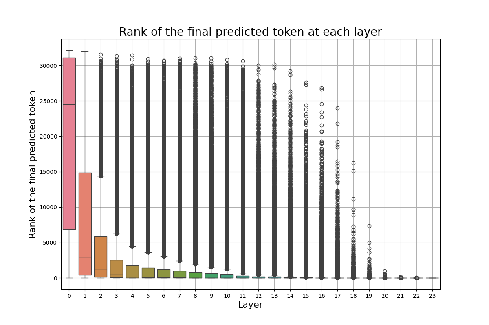
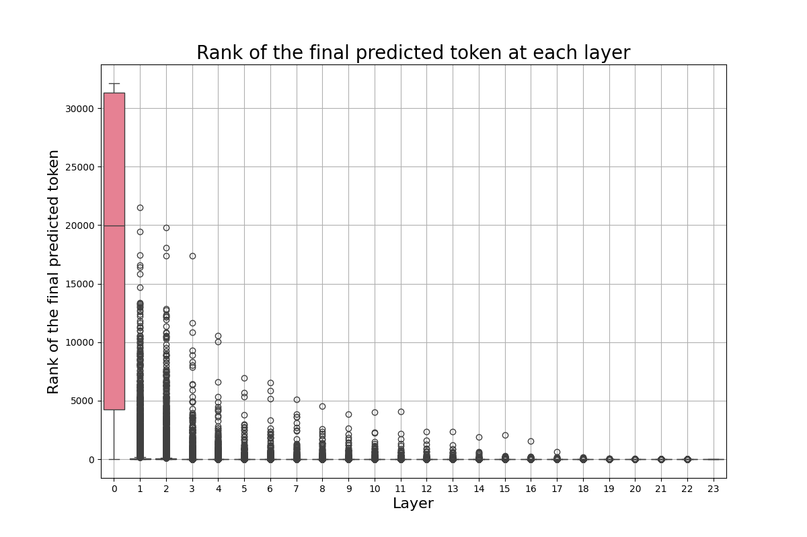
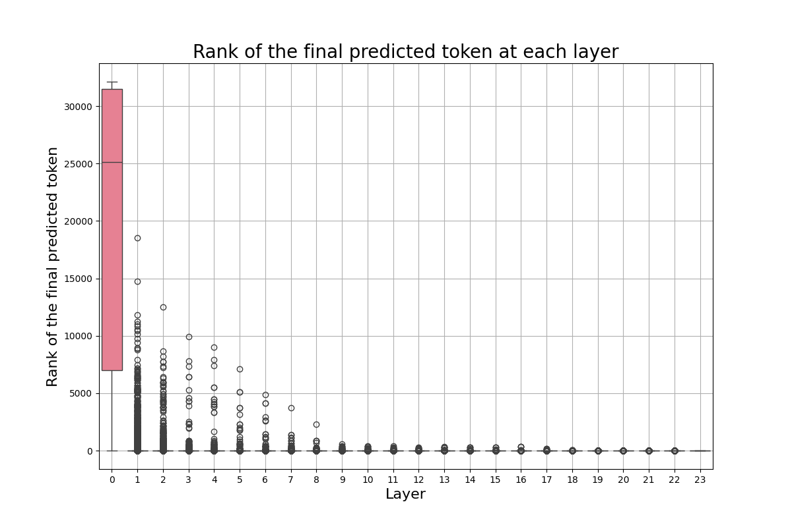

# Confidence is All you need 

### Karim Abdel Sadek, Gabriele Desimini, Matteo Nulli, Joan Velja, Jort Vincenti
---

## Introduction

Recent advancements in Large Language Models (LLMs) have significantly bolstered performance across various Natural Language Processing (NLP) tasks such as text generation, question answering, and machine translation *inter alia*[[7]](#1), [[8]](#1), [[9]](#1), [[10]](#1). These models, leveraging deep transformer architectures 11 \citep{vaswani2017attention}, generate language tokens autoregressively and provide a flexible framework across tasks with unified natural language input and output [[12]](#1), [[13]](#1), [[14]](#1). Efforts at improving the capabilities of these models have revolved around scaling the number of parameters and data [[15]](#1), [[16]](#1). In this context, previous literature show the power of *scaling laws*, which suggest that increasing the size of these models typically yields logarithmic improvements in performance across diverse linguistic benchmarks. These findings indicate that larger models are not only better at generalizing across more complex tasks but also show enhanced *efficiency in learning* from a vast array of data, providing more precise and contextually appropriate outputs. However, the substantial computational load presents a practical challenge during inference, particularly in resource-constrained applications or when serving these models at large scales. To address this issue, early-exiting mechanisms [[17]](#1) ,[[18]](#1), [[19]](#1), [[1]](#1) have been proposed, which allow LLMs to dynamically decide the number of layers to use based on the complexity of the input, thus reducing the inference time without significantly compromising performance. This approach, extensively adopted in other contexts in Machine Learning, is crucial because while scaling model architectures is beneficial during training, the same extensive computation may not be necessary at inference time for every input, especially for simpler tasks [[20]](#1), [[21]](#1). By enabling intermediate layer decoding, early exiting offers a promising solution to balance computational efficiency and model accuracy, ensuring that LLMs remain practical and effective in diverse application scenarios. To address this limitation, we propose two-fold improvements over the existing early-exit literature, in a way that enables both efficient and qualitative intermediate layer decoding. 

In this work, we analyze the early exiting paradigm for LLMs, and present a principled method for increasing model efficiency while remaining confident in the quality of the resulting predictions.
Our analysis covers challenges associated with the early-exiting framework. First, we study a phenomena of non-finetuned LMs, where the confidence at early layer is deemed to be high, but where accuracy is not satisfactory. This gives us grounds to experiment some heuristics for the minimum exit layer. Second, we provide a comparative analysis of finetuned versus non-finetuned LMs on a per-task basis, where we provide evidence of further attainable speedups under the finetuned regime.
Specifically, drawing from [[6]](#1), we develop a method for calibrating local, per-token, exit decisions such that global, sequence-level constraints —as determined by lexical or semantic sequence-level metrics like ROUGE score— are provably maintained with arbitrarily high probability (e.g., 95\%). Moreover, in order to offset the we leverage within-model *contrastive decoding* [[4]](#1), attaining a pareto improvement over runtime and performance.

## Related Works
There have been a large number of studies introducing different Early-Exiting frameworks to adress the increase inference time of Large Language Models \cite{schwartz2020right, simoulin2021many, bae2023fast, zhu2021leebert}. Early-Exiting is based on the intuition that each token needs distinct amounts of compute during generation. Not all tokens necessitate the same amount of compute to be generated, as such many methods have been implemented to achieve this. Some use a routing prediction method \cite{liu2021faster}, others employ an early-exit classifier \cite{schuster2021consistent}, while most of the work is done through softmax-based confidence measures [[6]](#1).

SOFTMAX PART

Introduced by [[4]](#1) *Contrastive Decoding* is a technique used to reduce unwanted behaviours in Large Language Models such as repetition and incoherence. The method is employing two models, a smaller one called amateur and a larger one, called expert. They both perform auto-regressive text generation on the same data, and the final predicted token is selected based on the outputs difference between the predictions of the expert and amateur. While this method is innovative, employing two LLMs is highly inefficient, both in terms of space and compute. Alternative methods have been proposed, which employ the contrastive decoding scheme, without the necessity of using two large models. An example of such work is the idea of Auto-Contrastive Decoding [[2]](#1) . The authors show how contrasting outputs of different layers within the same model can benefit text generation outputs. The study proves that predictions of shallow layers, which are often overlooked, can help those of deeper ones to attain better results. Other studies have adapted this technique to different tasks such as reducing hallucination in LLMs [[3]](#1). 

Our proposed confidence measures connect [[6]](#1) with [[2]](#1) and [[3]](#1). We do so by speeding up the softmax operation of [[6]](#1) and apply auto-contrastive decoding and Jensen-Shannon Divergence to early-exit framework together with the speedup framework of section [[Early Exiting Via the Softmax approach]](#1).

##  <a name="Methodology">Methodology</a> 

### <a name="Early Exiting Via the Softmax approach">Early Exiting Via the Softmax approach</a>
Our first approach aims to improve the speedup of the Softmax response approach introduced by [[6]](#1). The aforementioned confidence measure computes the difference between the top two values of Softmax $(\textbf{W}_i d_t^i)$, at each layer $i$. We denote this measure as $c_t^i$. If $c_t^i \geq \lambda_t^i$, the model exists early, providing us the current prediction computed at that layer.

However, the multiplication inside Softmax, i.e. $\textbf{W}_i d_t^i$ can be deemed as computationally expensive. Note that $\textbf{W}_i \in \mathbb{R}^{30.000 \times dim_d}$, where $30.000$ is our vocabulary size, and  $dim_d$ is equal to the size of the last hidden representation $d_t^i$ of our model. We note and argue that most of these computations are redundant, and potentially not necessary. In Figures below, we show the boxplots for the rank of the final predicted token at each layer, across not  fine-tuned and fine-tuned models, for two different datasets.
The main message these images convey to us is that the final predicted token is often already highly ranked from the first few layers of our model. This behavior is more explicit in Figure [boxplot2](plots/boxplot_topk_rank_evalsquad_google-t5_t5-large.png) and [boxplot4](plots/boxplot_topk_rank_evalsquad_jvelja_t5-squad.png), where we use fine-tuned models for our downstream task.

On the other hand, confidence alone can be a deceiving measure. LLMs can be too confident in the first layers, causing the model to exit prematurely. Our desiderata is for the model to be confident at the same when its prediction has a high accuracy. However, we find that this is not always the case.
In Figure [confidence](plots/conf_acc_temp.png), we see the accuracy and the confidence across each layer. The model in the first layers presents an anomalous high confidence, while its performance is poor. Early exiting only based on the Softmax response would result in highly poor performances. We decide to set a *minimum exit layer* parameter $j$, which forces the model to consider exiting only after this layer. Note that this parameter is highly dependent on the model and dataset one experiments on. For fine-tuned models for example, one expects this parameter to be smaller.

Motivated by these findings, we introduce two additional modifications to the Softmax response approach.

#### Softmax response via fixed pruning
After the minimum early exit layer $j$, we prune $\textbf{W}_j$, retaining its top-k tokens in the new vocabulary matrix. We define the new pruned matrix as $\tilde{\textbf{{W}}}_{j+i} \in \mathbb{R}^{k \times dim_d}$, for $i = 1, \dots, L-j$ and $k \ll 30.000$. Hence, we prune our matrix at layer $j+1$, and keep the size fixed to $k$ for all subsequent layers 

#### Softmax response via decaying pruning
As one can note from Figures 
[boxplot1](plots/boxplot_top1_rank_evalsamsum_google-t5_t5-large.png),
[boxplot2](plots/boxplot_topk_rank_evalsquad_google-t5_t5-large.png),
[boxplot3](plots/boxplot_top1_rank_evalsamsum_jvelja_t5-samsum.png)
and [boxplot4](plots/boxplot_topk_rank_evalsquad_jvelja_t5-squad.png), the rank of the predicted token smoothly decreases across layers, especially for non-fine-tuned models. Again, we prune the $\textbf{W}_j$ matrix, given a minimum early exit layer $j$. We retain its top k-tokens, obtaining the new pruned vocabulary matrix $\tilde{\textbf{{W}}}_{j+i} \in \mathbb{R}^{k \times dim_d}$. Now, instead of keeping the reduced matrix size fixed, we further prune it after every layer. Given the vocabulary matrix $\textbf{W}_{j+i}$ at layer $j+i$ of size $k_1$, we prune for layer $j+i+1$ it to a reduced matrix of size $k_2$, where 
$$
k_2 = \max\left(k^*, \left\lfloor \frac{k1}{1 + \frac{k1 - k^*}{k^*} \cdot \frac{j+i}{\text{num\_layers}}} \right\rfloor \right)
$$

$k^*$ here indicates the minimum size our vocabulary matrix $\textbf{W}_{j+i+1}$ can reach. 

The benefit of this approach is obvious, and justified. Our predicted token is often in the top-k ones, with a high value of $k$. Due to this, pruning the vocabulary matrix allows us to reduce the amount of computations we have to compute at each layer, while discarding only irrelevant tokens. While we trade-off some performance, this further speeds up the runtime of our model, allowing us to obtain notable efficiency gains.

### <a name="Contrastive Decoding ">Contrastive Decoding </a>

The second approach is based on results from [[4]](#1). The aforementioned work proposes *contrastive decoding* as a search-based decoding method, inspired by the fact that the failures of larger LMs, e.g., repetition, incoherence, are even more prevalent in smaller LMs, and that this difference signals which texts should be preferred. The original implementation involves the use of two models in parallel, returning the difference between the likelihood under a large LM - called the *expert* - and a small LM - called the *amateur*. We speculate the potential improvement of our original notion of confidence with this approach. We apply contrastive decoding by overcoming a clear limitation of the original work, that is parallel inference among the amateur and the expert models. For this reason, we use previous layers predictions as a proxy of the amateur model, thus removing the requirement of parallel decoding.

#### Weighted contrastive decoding
We call the first `Weighted contrastive decoding`. This method is an adapted version of Auto-contrastive Decoding of [[2]](#1).

#### Jensen-Shannon Divergence contrastive decoding
The `Jensen-Shannon Divergence (JSD) contrastive decoding` is inspired by [[3]](#1).

### Speed-up applied to Contrastive Decoding

## Results
We evaluate the encoder-decoder t5-large model [[22]](#1) on five different datasets and three different downstream tasks:

- Stanford Question Answering Dataset (SQuAD) with over 16k of annotated data [[23]](#1).
- SamSum a human-annotated dataset for abstractive Summarization [[24]](#1).
- CNN/DailyMail, over 300k news articles from CNN and DailyMail [[25]](#1).
- Multi-News a long-context multi-document Summarization dataset with news articles [[26]](#1).
- IWSLT 2017 [[27]](#1) a benchmark for Machine Translation for multiple language (English and German) directions.

We also compare the performance and effects of our proposed methods between the pre-trained only version [t5-large](https://huggingface.co/google-t5/t5-large), [long-t5-tglobal-base](https://huggingface.co/google/long-t5-tglobal-base) and the fine-tuned version of t5-large on each training dataset [t5-squad](https://huggingface.co/jvelja/t5-squad),[t5-samsum](https://huggingface.co/jvelja/t5-samsum), [t5-cndm](https://huggingface.co/jvelja/t5-cnndm), [t5-multinews](https://huggingface.co/jvelja/t5-multinews), [t5-bigpatent](https://huggingface.co/jvelja/t5-bigpatent) and [t5-IWSLT](https://huggingface.co/jvelja/t5-iwslt).

## Conclusions

## References
<a id="1">[1]</a>
Bae, Sangmin, Jongwoo Ko, Hwanjun Song, and Se-Young Yun. "Fast and robust early-exiting framework for autoregressive language models with synchronized parallel decoding." arXiv preprint arXiv:2310.05424 (2023).

<a id="1">[2]</a>
Gera, Ariel, Roni Friedman, Ofir Arviv, Chulaka Gunasekara, Benjamin Sznajder, Noam Slonim, and Eyal Shnarch. "The benefits of bad advice: Autocontrastive decoding across model layers." arXiv preprint arXiv:2305.01628 (2023).

<a id="1">[3]</a>
Chuang, Yung-Sung, Yujia Xie, Hongyin Luo, Yoon Kim, James Glass, and Pengcheng He. "Dola: Decoding by contrasting layers improves factuality in large language models." arXiv preprint arXiv:2309.03883 (2023).

<a id="1">[4]</a>
Li, Xiang Lisa, Ari Holtzman, Daniel Fried, Percy Liang, Jason Eisner, Tatsunori Hashimoto, Luke Zettlemoyer, and Mike Lewis. "Contrastive decoding: Open-ended text generation as optimization." arXiv preprint arXiv:2210.15097 (2022).

<a id="1">[5]</a>
Schuster, Tal, Adam Fisch, Jai Gupta, Mostafa Dehghani, Dara Bahri, Vinh Tran, Yi Tay, and Donald Metzler. "Confident adaptive language modeling." Advances in Neural Information Processing Systems 35 (2022): 17456-17472.

<a id="1">[6]</a>
Schuster, Tal, Adam Fisch, Jai Gupta, Mostafa Dehghani, Dara Bahri, Vinh Tran, Yi Tay, and Donald Metzler. "Confident adaptive language modeling." Advances in Neural Information Processing Systems 35 (2022): 17456-17472.

<a id="1">[7]</a>
Brown, Tom, Benjamin Mann, Nick Ryder, Melanie Subbiah, Jared D. Kaplan, Prafulla Dhariwal, Arvind Neelakantan et al. "Language models are few-shot learners." Advances in neural information processing systems 33 (2020): 1877-1901.

<a id="1">[8]</a>
Rae, Jack W., Sebastian Borgeaud, Trevor Cai, Katie Millican, Jordan Hoffmann, Francis Song, John Aslanides et al. "Scaling language models: Methods, analysis & insights from training gopher." arXiv preprint arXiv:2112.11446 (2021).

<a id="1">[9]</a>
Smith, Shaden, Mostofa Patwary, Brandon Norick, Patrick LeGresley, Samyam Rajbhandari, Jared Casper, Zhun Liu et al. "Using deepspeed and megatron to train megatron-turing nlg 530b, a large-scale generative language model." arXiv preprint arXiv:2201.11990 (2022).

<a id="1">[10]</a>
Chowdhery, Aakanksha, Sharan Narang, Jacob Devlin, Maarten Bosma, Gaurav Mishra, Adam Roberts, Paul Barham et al. "Palm: Scaling language modeling with pathways." Journal of Machine Learning Research 24, no. 240 (2023): 1-113.

<a id="1">[11]</a>
Vaswani, Ashish, Noam Shazeer, Niki Parmar, Jakob Uszkoreit, Llion Jones, Aidan N. Gomez, Łukasz Kaiser, and Illia Polosukhin. "Attention is all you need." Advances in neural information processing systems 30 (2017).

<a id="1">[12]</a>
Radford, Alec, Jeffrey Wu, Rewon Child, David Luan, Dario Amodei, and Ilya Sutskever. "Language models are unsupervised multitask learners." OpenAI blog 1, no. 8 (2019): 9.

<a id="1">[13]</a>
Raffel, Colin, Noam Shazeer, Adam Roberts, Katherine Lee, Sharan Narang, Michael Matena, Yanqi Zhou, Wei Li, and Peter J. Liu. "Exploring the limits of transfer learning with a unified text-to-text transformer." Journal of machine learning research 21, no. 140 (2020): 1-67.

<a id="1">[14]</a>
Touvron, Hugo, Thibaut Lavril, Gautier Izacard, Xavier Martinet, Marie-Anne Lachaux, Timothée Lacroix, Baptiste Rozière et al. "Llama: Open and efficient foundation language models." arXiv preprint arXiv:2302.13971 (2023).

<a id="1">[15]</a>
Kaplan, Jared, Sam McCandlish, Tom Henighan, Tom B. Brown, Benjamin Chess, Rewon Child, Scott Gray, Alec Radford, Jeffrey Wu, and Dario Amodei. "Scaling laws for neural language models." arXiv preprint arXiv:2001.08361 (2020).

<a id="1">[16]</a>
Hoffmann, Jordan, Sebastian Borgeaud, Arthur Mensch, Elena Buchatskaya, Trevor Cai, Eliza Rutherford, Diego de Las Casas et al. "Training compute-optimal large language models." arXiv preprint arXiv:2203.15556 (2022).

<a id="1">[17]</a>
Schwartz, Roy, Gabriel Stanovsky, Swabha Swayamdipta, Jesse Dodge, and Noah A. Smith. "The right tool for the job: Matching model and instance complexities." arXiv preprint arXiv:2004.07453 (2020).

<a id="1">[18]</a>
Zhu, Wei. "LeeBERT: Learned early exit for BERT with cross-level optimization." In Proceedings of the 59th Annual Meeting of the Association for Computational Linguistics and the 11th International Joint Conference on Natural Language Processing (Volume 1: Long Papers), pp. 2968-2980. 2021.

<a id="1">[19]</a>
Simoulin, Antoine and Benoît Crabbé. “How Many Layers and Why? An Analysis of the Model Depth in Transformers.” Annual Meeting of the Association for Computational Linguistics (2021).

<a id="1">[20]</a>
Geva, Mor, Roei Schuster, Jonathan Berant, and Omer Levy. "Transformer feed-forward layers are key-value memories." arXiv preprint arXiv:2012.14913 (2020).

<a id="1">[21]</a>
Geva, Mor, Avi Caciularu, Kevin Ro Wang, and Yoav Goldberg. "Transformer feed-forward layers build predictions by promoting concepts in the vocabulary space." arXiv preprint arXiv:2203.14680 (2022).

<a id="1">[22]</a>
Raffel, Colin, Noam Shazeer, Adam Roberts, Katherine Lee, Sharan Narang, Michael Matena, Yanqi Zhou, Wei Li, and Peter J. Liu. "Exploring the limits of transfer learning with a unified text-to-text transformer." Journal of machine learning research 21, no. 140 (2020): 1-67.

<a id="1">[23]</a>
Rajpurkar, Pranav, Jian Zhang, Konstantin Lopyrev, and Percy Liang. "Squad: 100,000+ questions for machine comprehension of text." arXiv preprint arXiv:1606.05250 (2016).

<a id="1">[24]</a>
Gliwa, Bogdan, Iwona Mochol, Maciej Biesek, and Aleksander Wawer. "SAMSum corpus: A human-annotated dialogue dataset for abstractive summarization." arXiv preprint arXiv:1911.12237 (2019).

<a id="1">[25]</a>
See, Abigail, Peter J. Liu, and Christopher D. Manning. "Get to the point: Summarization with pointer-generator networks." arXiv preprint arXiv:1704.04368 (2017).

<a id="1">[26]</a>
Fabbri, Alexander R., Irene Li, Tianwei She, Suyi Li, and Dragomir R. Radev. "Multi-news: A large-scale multi-document summarization dataset and abstractive hierarchical model." arXiv preprint arXiv:1906.01749 (2019).

<a id="1">[27]</a>
Cettolo, Mauro, Marcello Federico, Luisa Bentivogli, Niehues Jan, Stüker Sebastian, Sudoh Katsuitho, Yoshino Koichiro and Federmann Christian. “Overview of the IWSLT 2017 Evaluation Campaign.” International Workshop on Spoken Language Translation (2017).