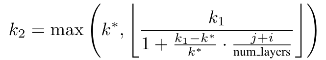

# Early Exit LLMs - Collaborative Content

## Introduction

Recent advancements in Large Language Models (LLMs) have significantly bolstered performance across various Natural Language Processing (NLP) tasks such as text generation, question answering, and machine translation ([Devlin et al., 2019](#bert-pre-training-2019); [Brown et al., 2020](#language-models-few-shot-2020); [Rae et al., 2021](#scaling-language-models-2021); [Smith et al., 2022](#using-deepspeed-megatron-2022); [Chowdhery et al., 2023](#palm-scaling-2023), inter alia). These models, leveraging deep transformer architectures ([Vaswani et al., 2017](#attention-is-all-you-need-2017)), generate language tokens autoregressively and provide a flexible framework across tasks with unified natural language input and output ([Radford et al., 2019](#language-models-unsupervised-multitask-2019); [Raffel et al., 2020](#exploring-limits-2020); [Touvron et al., 2023](#llama2-open-foundation-2023)). Efforts at improving the capabilities of these models have revolved around scaling the number of parameters and data ([Kaplan et al., 2020](#scaling-laws-2020); [Hoffmann et al., 2022](#training-compute-optimal-2022)).

In this context, previous literature shows the power of scaling laws, which suggest that increasing the size of these models typically yields logarithmic improvements in performance across diverse linguistic benchmarks. These findings indicate that larger models are not only better at generalizing across more complex tasks, but also show improved efficiency in learning from a vast array of data, providing more precise and contextually appropriate outputs. However, the substantial computational load presents a practical challenge during inference, particularly in resource-constrained applications or when serving these models at large scales.

To address this issue, early-exiting mechanisms ([Teerapittayanon et al., 2016](#branchynet-2016); [Schwartz et al., 2020](#right-tool-2020); [Zhu, 2021](#leebert-2021); [Simoulin & Crabbé, 2021](#model-depth-analysis-2021); [Bae et al., 2023](#fast-robust-early-exiting-2023)) have been proposed, which allow LLMs to dynamically decide the number of layers to use based on the complexity of the input, thus reducing the inference time without significantly compromising performance. This approach, extensively adopted in other contexts in Machine Learning, is crucial because while scaling model architectures is beneficial during training, the same extensive computation may not be necessary at inference time for every input, especially for simpler tasks ([Geva et al., 2021](#transformer-key-value-memories-2021); [2022](#transformer-promoting-concepts-2022)). By enabling intermediate layer decoding, early exiting offers a promising solution to balance computational efficiency and model accuracy, ensuring that LLMs remain practical and effective in diverse application scenarios.

To address this limitation, we propose two-fold improvements over the existing early-exit literature, in a way that enables both efficient and qualitative intermediate layer decoding.

Concretely, we assume we are given a set $S := \{\{P_i\}^n_{i=1} \in \mathcal{P}^n\}$ of independent and identically distributed (i.i.d.) prompts, each belonging to different tasks (summarization, machine translation, question-answering). We allow $P_{test}$ be an i.i.d. test prompt to our LLM, where $Y_{early} := LM_{early}(P_{test})$ and $Y_{full} := LLM_{full}(P_{test})$ are the early exiting and standard outputs of our LLM, respectively. In order to be satisfied with $Y_{early}$, we require it to be both textually consistent - i.e., to be sensical, accurate to a constant - and to have a smaller decoding runtime with respect to $Y_{full}$. To formalize our framework, we thus provide the following constraint:

$$
\mathbb{P}\left(\mathbb{E}\left[\mathcal{D} \left( Y_{\text{early}}, Y_{\text{full}}\right)\right] \leq \delta \right) \geq 1 - \epsilon
$$

Constraining on textual consistency with the original $`Y_{full}`$, however, can be cumbersome for most tasks: in summarization, for example, multiple generations may be acceptable; or in question-answering, writing a date in different formats may cause inconsistencies with the ground truth. Within Eq. (1), the goal of our work is to find the most computationally efficient $Y_{early}$, that is, generations that exit as early as possible while still maintaining our desired performance guarantees.

In this work, we analyze the early exiting paradigm for LLMs, and present a principled method for increasing model efficiency while remaining confident in the quality of the resulting predictions. Our preliminary analysis covers challenges associated with the early-exiting framework. First, we study a phenomenon of non-finetuned LMs, where the confidence at early layers is deemed to be high, but where accuracy is not satisfactory, thus resulting in poor calibration ([Mielke et al., 2022](#reducing-overconfidence-2022); [Band et al., 2024](#linguistic-calibration-2024)). This gives us grounds to experiment with some heuristics for the minimum exit layer. Second, we provide a comparative analysis of finetuned versus non-finetuned LMs on a per-task basis, where we provide evidence of further attainable speedups under the finetuned regime. Specifically, drawing from [Schuster et al. (2022)](#confident-adaptive-language-modeling-2022), we develop a method for calibrating local, per-token, exit decisions such that global, sequence-level constraints — as determined by lexical or semantic sequence-level metrics like ROUGE score — are provably maintained with arbitrarily high probability (e.g., 95%). Moreover, in order to offset the decrease in performance, we leverage within-model contrastive decoding ([Li et al., 2023](#contrastive-decoding-2023)), attaining a pareto improvement over runtime and performance.

Finally, we empirically validate our method on different NLP generation tasks, including text summarization and question answering. Our experiments demonstrate that, combining the two aforementioned approaches, we are able to actually attain the desiderata, which are gains in FLOPs efficiency and a reduced latency.

## Related Works

While the semantic nature of Natural Language is rich, some parts of a sentence often lack variance. In such cases, the number of layers the model has to go through to understand the right token is relatively low. Following this intuition, there have been a large number of studies introducing different Early-Exiting frameworks aimed at exploiting the reduction in compute for selected tokens, thus reducing the always increasing inference time of Large Language Models ([Teerapittayanon et al., 2016](#branchynet-2016); [Schwartz et al., 2020](#right-tool-2020); [Simoulin & Crabbé, 2021](#model-depth-analysis-2021); [Zhu, 2021](#leebert-2021); [Bae et al., 2023](#fast-robust-early-exiting-2023); [Geva et al., 2021](#transformer-key-value-memories-2021); [2022](#transformer-promoting-concepts-2022)). Many methods have been implemented to achieve this, some use a routing prediction method ([Liu et al., 2021](#faster-depth-adaptive-transformers-2021)), others employing an early-exit classifier ([Schuster et al., 2021](#confident-adaptive-transformers-2021)). However, most of the work is done through softmax-based confidence measures ([Schuster et al., 2022](#confident-adaptive-language-modeling-2022)). Here, the challenge of early-exiting is addressed by introducing a framework that dynamically allocates computational resources per input and generation time-step. Local exit decisions are calibrated per token but maintaining sequence-level constraints. This ensures computational efficiency without excessive performance degradation. The study also validates their claims both through theoretical analysis and experimentation on diverse text generation tasks and datasets.

Differently, [Zhu (2021)](#leebert-2021) introduces a new learning scheme. LeeBERT implements a bi-level optimization problem and a cross-level optimization algorithm. This method allows each exit to learn from others and adjusts the weights of different loss terms. Experiments on the GLUE benchmark demonstrate its effectiveness compared to other state-of-the-art early-exit methods.

[Bae et al. (2023)](#fast-robust-early-exiting-2023) is instead addressing the early-exiting challenge by introducing the Fast and Robust Early Exiting framework (FREE). This framework's main contribution is the introduction of a shallow-deep module determining the computational path to be chosen and therefore whether the full model layers need to be used or only part of them is sufficient. Alternatively, [Wang et al. (2024)](#class-exclusion-2024) propose a class-based early-exiting strategy. This method foresees the use of intermediate layer features to exclude part of the tokens, allowing later layers to focus on a reduced subset of potential tokens. Experimental results prove the effectiveness in dynamic neural network inference by reducing computational costs while maintaining high performance.

This research paper is based on the Early-Exit Framework introduced by [Schuster et al. (2022)](#confident-adaptive-language-modeling-2022). We propose an alternative, which reduces the number of Floating Point Operations per second (FLOPs), making it faster and computationally more efficient. Additionally, we combine it with a Contrastive Decoding framework ([Li et al., 2023](#contrastive-decoding-2023)). Contrastive Decoding is a technique used to reduce unwanted behaviors in Large Language Models such as repetition and incoherence. The method employs two models, a smaller one called amateur and a larger one, called expert. They both perform auto-regressive text generation on the same data, and the final predicted token is selected based on the output difference between the predictions of the expert and amateur. While this method is innovative, employing two LLMs is highly inefficient, both in terms of memory and compute. Alternative methods have been proposed, which employ the contrastive decoding scheme, without the necessity of using two large models. An example of such work is the idea of Auto-Contrastive Decoding ([Gera et al., 2023](#auto-contrastive-decoding-2023)). The authors show how contrasting outputs of different layers within the same model can benefit text generation outputs. The study proves that predictions of shallow layers, which are often overlooked, can help those of deeper ones to attain better results. Other studies have adapted this technique to different tasks such as reducing hallucination in LLMs ([Chuang et al., 2024](#dola-contrasting-layers-2024)). Our proposed contrastive decoding techniques are based on both [Gera et al. (2023)](#auto-contrastive-decoding-2023) and [Chuang et al. (2024)](#dola-contrasting-layers-2024) and adapted to the aforementioned early-exiting framework of [Schuster et al. (2022)](#confident-adaptive-language-modeling-2022).

## Preliminaries

### Transformer Architecture

The Transformer network, introduced by [Vaswani et al. (2017)](#attention-is-all-you-need-2017), is structured into $L$ layers, each comprising two distinct sublayers: the Multi-Head Attention (MHA) layer and the Feed-Forward Network (FFN) layer. Within this framework, updates to the residual stream for a subsequent prediction are carried out via the following recursive formula:

$$h^\ell_t = \text{Transformer}^\ell(h^{\ell-1}_t)$$

where $\ell$ represents each layer from 1 to $L$, and $h^0_t$ denotes the output of the embedding layer $`\textbf{W}_E`$. The embedding layer $`\textbf{W}_E \in \mathbb{R}^{d_{\text{vocab}} \times d_{\text{model}}}`$, transforms the tokens $y_{1:t}$ having size $d_{\text{vocab}}$, into dense vector representations sized $d_{\text{model}}$.

After processing through the $L$-th layer, the prediction for the next token, $\hat{x}_{t+1}$, is produced by

$p(\hat{x}_{t+1} \mid x_{< t+1}) = \text{softmax}(\textbf{W}_L h^L_{t})$

where 

$\textbf{W}_L \in \mathbb{R}^{d_{\text{model}} \times d_{\text{vocab}}}$ 

is the linear classifier of block L responsible for mapping back the output of the FNN at that block from 

$d_{\text{model}}$ to $d_{\text{vocab}}$.

Our approach incorporates an early-exiting strategy, wherein the generation of the next token can occur at any layer $`\ell`$ if the computed confidence score $`c_\ell`$ exceeds a specified threshold $`\tau`$.

When an early exit is triggered at layer $`\ell`$, it necessitates updating the key and value pairs in subsequent layers to ensure proper attention mechanisms for future tokens. To efficiently manage this, a state copying technique is employed, where the hidden states from the early-exited layer $`h^{\ell}_{t+1}`$ are duplicated across subsequent layers ($`h^i_{t+1} = h^{\ell}_{t+1}`$ for every $i$ from $\ell + 1$ to $L$). This process maintains computational efficiency and model performance, even in compact - for today's standards - model configurations like T5 models.

### Models, Datasets and Implementation Preliminaries

## Methodology

### Early Exiting Via the Softmax Approach

Our first approach aims to improve a limitation of the Softmax response method introduced by [Schuster et al. (2022)](#confident-adaptive-language-modeling-2022). We denote the final output of layer $\ell$ as

$\textbf{v}^\ell = \text{Softmax}(\textbf{W}_\ell h^{\ell}_{t})$

The so-called confidence measure is computed as the difference between the top two values of the probits vector $`\textbf{v}`$, at each layer $\ell$. We denote this measure as $`c^{\ell}_{t+1}`$. Let us define an early-exit threshold $\tau^{\ell}_{t+1}$ at each layer. If our confidence measure exceeds the early exit-threshold,

$c^{\ell}_{t+1} \geq \tau^{\ell}_{t+1}$

the model exits early, providing us with the prediction for the next token computed at that layer. Otherwise, it continues by going into the next Transformer block. However, the matrix multiplication inside Softmax, i.e., $`\textbf{W}_\ell h^{\ell}_{t}`$ is computationally expensive, especially when iterated over multiple layers. The exact number of computations for the matrix multiplication above corresponds to $d^2_{\text{model}} \times d_{\text{vocab}} \times L$. Hence, if we prune at the first layer the vocabulary size from $d_{\text{vocab}}$ to $k$, the number of computations required will reduce to $d^2_{\text{model}} \times k \times L$.

Note that $`\textbf{W}_\ell \in \mathbb{R}^{d_{\text{vocab}} \times d_{\text{model}}}`$, where $d_{\text{vocab}} \approx 32,000$ is our vocabulary size, and $d_{\text{model}}$ is equal to the size of the last hidden representation of our FNN. Both parameters are on a scaling upwards trend in SOTA architectures. We note and argue that most of these computations are redundant, and potentially not necessary for some tasks, in line with the literature. In Figure 1, we show the boxplots for the rank of the final predicted token at each layer, across not fine-tuned and fine-tuned models, for two different datasets. The main takeaway from these images is that the final predicted token is often already highly ranked from the first few layers of our model. This behavior is more explicit in Figures 1b and 1d, where we use fine-tuned models for our downstream tasks. On the other hand, confidence alone can be a deceiving measure. LLMs can be overconfident in the first layers, causing the model to exit prematurely. Our desiderata is for the model to be confident at the same time when its prediction has a high accuracy, that is, to be calibrated. However, we interestingly note that such behavior is rarely observed at early layers. In Figures 2 and 3, we see the accuracy and the confidence across each layer. The model in the first layers presents an anomalously high confidence, while its performance is still poor. Early exiting only based on the Softmax response would result in bad performance. We decide to set a minimum exit layer parameter $j$, which forces the model to consider exiting only after this layer. Note that this parameter is highly dependent on the model and dataset one experiments on. For fine-tuned models for example, one expects this parameter to be smaller.

Motivated by these findings, we introduce three additional modifications to the Softmax response approach.

**Softmax response via fixed pruning** After the minimum early exit layer $j$, we prune $`\textbf{W}_j`$, retaining its top-k tokens in the new unembedding matrix. We define the size of the new pruned matrix as

$\tilde{\textbf{W}}_{j+i} \in \mathbb{R}^{d_{\text{model}} \times k}, \quad \textrm{for} \quad i = 1, \ldots, L-j \quad \textrm{and} \quad k \ll d_{\text{vocab}}$

Hence, we prune our matrix at layer $j+1$, and keep the size fixed to $k$ for all subsequent layers. Theoretically, calculating the ratio between the original number of computations required in the original approach with ours, we get

$\frac{d^2_{\text{model}} \times d_{\text{vocab}} \times L}{d^2_{\text{model}} \times k \times (L-j) + d^2_{\text{model}} \times d_{\text{vocab}} \times j}$

which corresponds to an approximate efficiency gain of order

$\mathcal{O}\left(\frac{d_{\text{vocab}}}{k} \times (L-j)\right)$

**Softmax response via decaying pruning** 

As one can note from Figure 1b, the rank of the predicted token smoothly decreases across layers, especially for non-fine-tuned models. Again, we prune the $`\textbf{W}_j`$ matrix, given a minimum early exit layer $j$. We retain its top $k$-tokens, obtaining the new pruned vocabulary matrix

$\tilde{\textbf{W}}_{j+i} \in \mathbb{R}^{k \times d_{\text{model}}}$.

Now, instead of keeping the reduced matrix size fixed, we further prune it after every layer. Given the vocabulary matrix $\tilde{\textbf{W}}_{j+i}$ at layer $j+i$ of size $k_1$, we prune it for layer $j+i+1$ to a reduced matrix of size $k_2$, where

$k^*$ here indicates a lower bound on the size our pruned vocabulary matrix $\tilde{\textbf{W}}_{j+i+1}$ can reach. This function has been chosen based on Figure 1a, hence to be robust against the worst case scenario among all datasets and models. The function we defined here above approximates the decaying in ranking of the top-k token in that case. The efficiency gain is, in theory, even more prominent than in the case of fixed pruning.

**Softmax response via adaptive pruning**

To summarize, our predicted token is often in the top-k ones, with a high value of $k$. Due to this, pruning the vocabulary matrix allows us to reduce the amount of computations we have to compute at each layer, while discarding only irrelevant tokens. While we trade-off some performance, this further speeds up the runtime of our model, allowing us to obtain notable efficiency gains.

(a) non fine-tuned T5-Large model, SQuAD Dataset (b) fine-tuned T5-Large model, SQuAD Dataset

(c) non fine-tuned T5-Large model, SamSum Dataset (d) fine-tuned T5-Large model, SamSum Dataset

**Figure 1: Boxplots of the rank of final predicted token at each layer, across 2 different models and 2 different datasets.**

**Figure 2: Confidence vs F1 accuracy. T5-base model, SQuAD dataset**

**Figure 3: Confidence vs F1 accuracy. Fine-Tuned model, SQuAD dataset**

### Addressing the Trade-Off Via Contrastive Decoding
The second approach (Figure 4) is based on results from [Li et al. (2023)](#contrastive-decoding-2023). The aforementioned work proposes contrastive decoding (CD) as a search-based decoding method. This is inspired by the fact that the failures of larger LMs, e.g., repetition, incoherence, are even more prevalent in smaller LMs. By contrasting outputs of smaller LMs with larger ones the impact of the aforementioned failure reduces as a consequence. In more detail, even when both types of models agree on a high-probability token—frequently a repetitive one—, expert models tend to distribute a significant portion of the probability across a variety of other plausible, non-repetitive token options. This behavior underlines the understanding of language contexts by the expert models, reflecting their ability to consider a broader array of potential continuations. By effectively sidelining these sub-optimal behaviors, CD leverages the more sophisticated predictive capabilities of the larger models. The core goal of this method is to refine the output text by filtering through the lens of larger models, retaining only their superior, diverse linguistic predictions while excluding the limitations typically exhibited by smaller models. This results in text generation that not only avoids redundancy but also enriches the content quality, aligning it to human-like language. The original implementation involves the use of two models in parallel, returning the difference between the probits $p_{\text{EXP}}$ of a large LM - called the expert - and the probits $p_{\text{AMA}}$ of a small LM - called the amateur.

Following [Li et al. (2023)](#contrastive-decoding-2023), we first implement the CD adaptive plausibility constraint, $`\nu_{\text{head}}(x_{< t})`$, defined by:

$\nu_{\text{head}}(x_{< t}) = \{x_t \in V : p_{\text{EXP}}(x_t|x_{< t}) \geq \alpha \max_{x'_t \in V} p_{\text{EXP}}(x'_t|x_{< t})\}$

It’s important to recognize that smaller LMs, despite their limitations, do reliably capture basic elements of English grammar and essential common sense principles, such as subject-verb agreement. Therefore, applying the CD objective indiscriminately could inadvertently penalize these correct linguistic behaviors, leading to false negatives. Similarly, it might also erroneously reward implausible token choices, resulting in false positives. To address these potential pitfalls, we incorporate the aforementioned plausibility constraint into our framework. Given a preceding context $`x_{< t}`$, this constraint selects a subset of plausible next tokens, out of the vocabulary $V$, whose probabilities are above a threshold. The threshold is a fraction $\alpha$ of the probability of the token with the highest probability in the vocabulary. The hyperparameter $\alpha$ is in the range $[0, 1]$, and it is set by the authors of the original work to 0.1 without any explanation about the heuristic assumption. What we found in our experiments, instead, is that setting this parameter to 0.1 leads to overconfidence. For this reason, we thus propose a different way to address the parameter, not requiring tuning and taking into account the notion of confidence we already calculate for the purpose of EE. We therefore propose a hyperbolic decaying schedule for $\alpha$ defined as follows:

$$
\alpha' = \left(\frac{\alpha}{1 + \text{decay rate} \times \ell}\right) \times (1 - \text{confidence})
$$

The intuition for this is that we want to combine the decay of the threshold over iterations with the confidence of the predictions, allowing for a more relaxed threshold as confidence increases and iterations progress. Formally, to translate the concept of CD into a practical application, we introduce a contrastive objective, called Log Contrastive Difference (LCD), defined as:

$$
p_{\text{LCD}}(x_t | x_{< t}) = \text{Softmax}\left(\log \frac{p_{\text{EXP}}(x_t | x_{< t})}{p_{\text{AMA}}(x_t | x_{< t})}\right)
$$

This CD objective is designed to promote text patterns that are preferred by the larger, expert LMs and discourage those that are typically produced by the smaller, amateur LMs. It works in tandem with the plausibility constraint, to ensure that the penalization of amateur behaviors does not disregard grammatically correct and sensible language constructs. By doing this, we aim to refine the CD approach, enabling it to differentiate effectively between undesirable simplicity and necessary linguistic accuracy, thus avoiding common errors in model-generated text. Thus the final distribution will be:

$$
p_{\text{DCD}}(x_t | x_{< t}) =
\begin{cases}
p_{\text{LCD}}(x_t | x_{< t}) & \text{if} \ x_t \in V_{\text{head}}(x_{< t}) \\
p_{\text{EXP}}(x_t | x_{< t}) & \text{otherwise}
\end{cases}
$$

We take the original approach by [Li et al. (2023)](#contrastive-decoding-2023) a step further: instead of running inference on parallel models, thus requiring significant compute overhead, we substitute the amateur, smaller model by proxying it with the distribution obtained at earlier layers of the attention stack, and the expert model distribution with the layer $\ell$ we find ourselves at. This intuition is aligned with findings by [Elbayad et al. (2019)](#contrastive-decoding-2019) and [Geva et al. (2021)](#transformer-key-value-memories-2021); [Geva et al. (2022)](#transformer-promoting-concepts-2022). One question that arises naturally from this idea is previous layer selection.

We therefore thought of a simple, yet effective way of addressing this choice. Previous works ([Chuang et al., 2024](#dola-contrasting-layers-2024)) suggest selection via distance-in-distribution through Jensen-Shannon Divergence. This way, they claim, it is possible to find the most fit amateur layer for the contrastive objective. They do so by contrasting the final distribution against a set of candidate layers for premature layer selection $J$. They divide the layers into 2 to 4 buckets of $J$ based on the total number of layers, relying on a validation set to choose the best bucket for each task. With an Occam’s razor perspective, we claim that the bucketing strategy is suboptimal for several reasons. First, it requires task-specific selection, which is undesirable, given how these models are deployed and utilized by end users, that is, usually, for open-ended generation. Second, bucketing does not address the bias JSD will have towards the lower layers of the distribution. Earlier representations are necessarily more diverse, since the set of plausible tokens for autoregressive generation gets narrower as one goes deeper into the stack. For this reason, we discount the JSD value between two distributions $i, j$ by the layer distance between the two distributions $\ell_j - \ell_i$. By doing this, we are able to capture the layers at which there is a more significant distribution change w.r.t. the layer $\ell_j$ we find ourselves at, thus obtaining meaningful signal from the chosen contrastive distribution. Moreover, in order to avoid computational overhead given by the linear map $\textbf{W}_L$, we only contrast distributions at layer $\ell$ against distributions at layers $m < \ell_0 <$, where $j$ is the minimum exit layer parameter introduced in Section 4.1.

Finally, to get the best of both worlds, we experiment with a mixed approach. The rationale here is that we can substitute the plausibility constraint of CD with the top-k tokens we find with the pruning done for softmax response, thus making what we claim to be a choice as informed as possible.

## Experiments

### Experimental Setting

We evaluate the encoder-decoder T5 model ([Raffel et al., 2020](#exploring-limits-2020)) on two different datasets and two different downstream tasks:

- Stanford Question Answering Dataset (SQuAD) with over 100k annotated data ([Rajpurkar et al., 2016](#squad-2016)), 10k of which used for evaluation.
- SamSum ([Gliwa et al., 2019](#samsum-corpus-2019)), a human-annotated dataset for abstractive Summarization with more than 800 samples in the Validation set.

Each dataset has its own evaluation metrics. Question Answering on SQuAD will be evaluated on F1, whereas Summarization on SamSum on Rouge-L score.

Additionally, we compare the performance and effects of our proposed methods between:

- Pre-trained-only version of T5, from t5-large,
- Fine-tuned version of T5, t5-squad, t5-samsum. Each fine-tuned version is fine-tuned on the training dataset of the corresponding name.

Within our experiments, we rely on terminology which is dependent on the hyper-parameters used, the most important being the minimum exit layer. This is nothing but the earliest layer at which the model is allowed to exit.

Finally, all the experiments in the following sections are done using the available codebase fast-robust-early-exit ([Bae et al., 2023](#fast-robust-early-exiting-2023)) as baseline.

### Softmax Speed-Up

In this section, the results of the different Soft-max reductions applied to the $`\textbf{W}_{j}`$ matrix will be reported. The aim is to achieve similar performance with regards to the evaluation metrics while drastically reducing the amount of FLOPs. We acknowledge this trade-off: tolerating a slightly higher error rate in exchange for significantly reduced computations.

We create our experiments by using the available implementation as a baseline and determine the minimum exit layer based on the lowest confidence level found in Graphs 2 and 3. We then compare these results with our new functions, either fixed or decaying reduction, as presented in Section 4.1. We evaluate the models based on their respective performance metrics and the number of floating point operations (FLOPs) generated by one sample. This evaluation is conducted for both the question-answering task (see Figure 4) and the summarization task (see Figure 5).

The overall performance displays the following trend: similar performance is achieved across the evaluation metrics, but the amount of FLOPs decreases by a hundredfold for all tasks. Additionally, between fixed and decaying reduction, half of the FLOPs are utilized, but there is a 2% loss in performance. This illustrates the trade-off: choosing a smaller $k$ reduces the number of FLOPs but at the cost of lower performance. Additionally, due to Finetuned models exiting at earlier stages, fewer FLOPs are observed overall. However, the same trade-off can be observed.

We set the minimum confidence required for an exit at 0.9 to achieve a speed-up while maintaining good results. It is important to note that if this value would be lowered, our model would exit earlier, thus poorer predictions but quicker performance would be observed regardless of the implementation type. As a result, similarly to the observation between the fine-tuned and non-fine-tuned models, we claim that the gains in FLOPs would be less significant but still observable.

However, some limitations and future work can be established. Firstly, the function that shrinks the $k$ values is based on the worst-case scenario observed in the data (see Figure 1). This function could be adjusted depending on the problem type or the model. For instance, a Finetuned model, as depicted in Figure 1b, might benefit from more aggressive shrinkage compared to its non-Finetuned counterpart. Secondly, the overall runtime performance has not yet matched the improvements seen in FLOPs. This discrepancy is largely due to the hyper-optimization of the Torch library, which optimizes matrix multiplications, thereby reducing overall runtime. Additionally, since we are working with pre-trained tokenizers, reducing the $W_j$ matrix leads to incorrect predictions, necessitating a remapping back to the original vocabulary size. This process introduces an overhead that further worsens runtime.

### Contrastive Decoding

In this section, we analyze the behavior of the two implemented versions of contrastive decoding confidence measures, Weighted and Jensen-Shannon Divergence (JSD) contrastive decoding. The aim of this section is to determine the impact of Contrastive Decoding techniques on performance and average exit. Due to time and compute constraints, the results displayed below are reported on 100 samples on both SQuAD and SamSum datasets.

Results from Figure 6 show Weighted contrastive decoding achieving comparable average exit layer with softmax baseline, while still retaining almost all the performance. More interesting is the behavior of JSD. The confidence measure consistently beats softmax baseline. The method is exiting earlier with an average gain of 2.5 blocks. Most importantly, it is also achieving higher performance with a 2% increase over both softmax and the no exiting network (green). The reason for the lack in performance in earlier layers for contrastive decoding confidences is in their intrinsic nature. Figure 2 clearly shows that while confidence at earlier layers is very high, their accuracy is very low. This means that contrasting the probability outputs of the amateur layer with the expert, at early layers, results in catastrophically pushing the model towards the earlier end of the curve, resulting in the model being wrongly over-confident.

Evaluation on SamSum dataset, Figure 7, shows even more impressive results. While weighted contrastive decoding is on par with softmax baseline, the Jensen-Shannon Divergence (JSD) confidence measure is exiting even earlier on average with an impressive 2.9 block difference gain on average with softmax. Additionally, JSD is notably attaining almost a 10% increase in Rouge-L performance on exit-layer 17.

(a) Average Exit Block (b) F1 Accuracy

**Figure 6: SQuAD Average Exit and F1. The first picture shows the average exit layer across different minimum exit layers. The second the F1 score across different minimum exit layers. Results are reported on t5-large non-finetuned model on SQuAD dataset.**

(a) Average Exit Block (b) Rouge-L Accuracy

**Figure 7: SamSum Average Exit and Rouge-L. The first picture shows the average exit layer across different minimum exit layers. The second the F1 score across different minimum exit layers. Results are reported on t5-large non-finetuned model on SamSum dataset.**

### Speedup and Contrastive Decoding

Jensen-Shannon Divergence (JSD) confidence measure has shown notable performance gains with respect to softmax baseline and weighted contrastive decoding in Section 4.4. In this chapter, we set out to investigate what could be the result when merging the softmax pruning of Section 4.2 with JSD. Additionally, we compare the best pruning method for Contrastive Decoding of Section 4.5 with the previously analyzed baselines. We show that combining the performant JSD technique with a compute efficient pruning mechanism significantly impacts the results. This will be done in terms of average exit, performance, and compute FLOPs.

#### Best JSD Pruning Combination

First, we perform a series of experiments aimed at understanding the best possible pruning method for the best contrastive decoding confidence measure from Section 4.4, Jensen-Shannon Divergence (JSD).

Following the argument of Section 4.4, we consider the most informative minimum exit layers to be the highest ones, meaning 15, 17, 18, 19, 20. Keeping this in mind, Table 1 represents the mean exit layer and performance averaged across these minimum exit layer parameters. We note how the adaptive pruning strategy consistently beats fixed and decaying, especially on earlier exiting, with an average gain of 1.2 blocks against fixed on SamSum. The only exception is the fixed pruning achieving the highest Rouge-L score in SamSum. For these reasons, we choose adaptive to be the most fitting pruning method in combination with Jensen-Shannon Divergence (JSD) confidence measure. We defer to Appendix A a series of detailed plots with all minimum exit layers in this setting.

**Table 1: JSD with pruning. Comparison Across different pruning methodologies applied to Jensen-Shannon Divergence (JSD) confidence measure. The values in the table are the mean of exit/performance over the last 4 early minimum exit layer ± their standard deviation.**

#### Comparison with Baseline Models

Given the results of Section 4.5, and our analysis of the best minimum exit layer parameters to use in the contrastive decoding setting, we now compare the most performing pruning method of Section 4.6 with the baselines from Sections 4.3 and 4.2. We do so by selecting the minimum exit layer of 19 for all the analyzed methods. The choice is made by comparing the performance of each metric and selecting the best for each of them.

As explained in section 4.1, pruning was introduced to speed-up the softmax approach by reducing the un-embedding operations. In section 4.2 we show the big impact this has on FLOPs. Similarly, Figures 8 and 9 show that removing a large number of tokens has a huge effect on compute, reducing it by almost 250 times on SQuAD and 190 on SamSum between JSD baseline and JSD with adaptive pruning. This impressive gap is also more impressive when looking at the amount of performance retained. On both fine-tuned and non-finetuned models the decrease in performance between the techniques is never more than 2%, with JSD with adaptive even achieving a 1.9% increase on softmax baseline on SQuAD.

Lastly, we highlight that the difference in results between Figures 4, 5, and Figures 8, 9 are due to the different number of samples we perform evaluation on. While in section 4.2 we use the whole dataset, here we only employ 100 samples due to compute constraints. However, in both cases, our results are consistent both in terms of performance and FLOPs reduction.

(a) F1 Metric (b) FLOPs per sample

**Figure 8: Performance on Question-Answering Task. Comparison of model performance in terms of F1 score and the amount of FLOPs generated per sample. The minimum exit layer was set to 7 for T5-Large and 2 for T5-Large Finetuned, with the confidence set at 0.9 for both. Results are reported across 100 samples on SQuAD.**

(a) Rouge-L Metric (b) FLOPs per sample

**Figure 9: Performance on Summarization Task. Comparison of model performance in terms of ROUGE-L score and the amount of FLOPs generated per sample. The minimum exit layer was set to 19 across both T5-Large and T5-Large Finetuned, with the confidence set at 0.9 for both. Results are reported across 100 samples on SamSum.**

## Conclusions

**References**

<a id="fast-robust-early-exiting-2023">Bae Sangmin, Ko Jongwoo, Yun Se-Young. (2023). Fast and Robust Early-Exiting Framework for Autoregressive Language Models with Synchronized Parallel Decoding. arXiv preprint arXiv:2310.05424.</a>

<a id="linguistic-calibration-2024">Band Neil, Li Xuechen, Ma Tengyu, Hashimoto Tatsunori. (2024). Linguistic Calibration of Language Models. arXiv preprint arXiv:2404.00474.</a>

<a id="language-models-few-shot-2020">Brown Tom B, Mann Benjamin, Ryder Nick, Subbiah Melanie, Kaplan Jared, Dhariwal Prafulla, Neelakantan Arvind, Shyam Pranav, Sastry Girish, Askell Amanda, Agarwal Sandhini, Herbert-Voss Ariel, Krueger Gretchen, Henighan Tom, Child Rewon, Ramesh Aditya, Ziegler Daniel M, Wu Jeffrey, Winter Clemens, Hesse Christopher, Chen Mark, Sigler Eric, Litwin Mateusz, Gray Scott, Chess Benjamin, Clark Jack, Berner Christopher, McCandlish Sam, Radford Alec, Sutskever Ilya, Amodei Dario. (2020). Language Models are Few-Shot Learners. arXiv preprint arXiv:2005.14165.</a>

<a id="palm-scaling-2023">Chowdhery Aakanksha, Narang Sharan, Devlin Jacob, Bosma Maarten, Mishra Gaurav, Roberts Adam, Barham Paul, Chung Hyung Won, Sutton Charles, Gehrmann Sebastian, and others. (2023). Palm: Scaling language modeling with pathways. Journal of Machine Learning Research, 24(240), 1-113.</a>

<a id="dola-contrasting-layers-2024">Chuang Yung-Sung, Xie Yujia, Luo Hongyin, Kim Yoon, Glass James, He Pengcheng. (2024). DoLa: Decoding by Contrasting Layers Improves Factuality in Large Language Models. arXiv preprint arXiv:2309.03883.</a>

<a id="bert-pre-training-2019">Devlin Jacob, Chang Ming-Wei, Lee Kenton, Toutanova Kristina. (2019). BERT: Pre-training of Deep Bidirectional Transformers for Language Understanding. In Proceedings of the 2019 Conference of the North American Chapter of the Association for Computational Linguistics: Human Language Technologies, Volume 1 (Long and Short Papers) (pp. 4171-4186). Minneapolis, Minnesota: Association for Computational Linguistics.</a>

<a id="multi-news-2019">Fabbri Alexander R, Li Irene, She Tianwei, Li Suyi, Radev Dragomir R. (2019). Multi-news: A large-scale multi-document summarization dataset and abstractive hierarchical model. arXiv preprint arXiv:1906.01749.</a>

<a id="transformer-key-value-memories-2021">Geva Mor, Schuster Roei, Berant Jonathan, Levy Omer. (2021). Transformer Feed-Forward Layers Are Key-Value Memories. In Proceedings of the 2021 Conference on Empirical Methods in Natural Language Processing (pp. 5484-5495). Online and Punta Cana, Dominican Republic: Association for Computational Linguistics.</a>

<a id="transformer-promoting-concepts-2022">Geva Mor, Caciularu Avi, Wang Kevin, Goldberg Yoav. (2022). Transformer Feed-Forward Layers Build Predictions by Promoting Concepts in the Vocabulary Space. In Proceedings of the 2022 Conference on Empirical Methods in Natural Language Processing (pp. 30-45). Abu Dhabi, United Arab Emirates: Association for Computational Linguistics.</a>

<a id="samsum-corpus-2019">Gliwa Bogdan, Mochol Iwona, Biesek Maciej, Wawer Aleksander. (2019). SAMSum corpus: A human-annotated dialogue dataset for abstractive summarization. arXiv preprint arXiv:1911.12237.</a>

<a id="training-compute-optimal-2022">Hoffmann Jordan, Borgeaud Sebastian, Mensch Arthur, Buchatskaya Elena, Cai Trevor, Rutherford Eliza, Casas Diego de Las, Hendricks Lisa Anne, Welbl Johannes, Clark Aidan, and others. (2022). Training compute-optimal large language models. arXiv preprint arXiv:2203.15556.</a>

<a id="class-exclusion-2024">Jingcun Wang, Bring Li, Grace Li Zhang. (2024). Early-Exit with Class Exclusion for Efficient Inference of Neural Networks.</a>

<a id="scaling-laws-2020">Kaplan Jared, McCandlish Sam, Henighan Tom, Brown Tom B, Chess Benjamin, Child Rewon, Gray Scott, Radford Alec, Wu Jeffrey, Amodei Dario. (2020). Scaling laws for neural language models. arXiv preprint arXiv:2001.08361.</a>

<a id="contrastive-decoding-2023">Li Xiang Lisa, Holtzman Ari, Fried Daniel, Liang Percy, Eisner Jason, Hashimoto Tatsunori, Zettlemoyer Luke, Lewis Mike. (2023). Contrastive Decoding: Open-ended Text Generation as Optimization. arXiv preprint arXiv:2210.15097.</a>

<a id="faster-depth-adaptive-transformers-2021">Liu Yijin, Meng Fandong, Zhou Jie, Chen Yufeng, Xu Jinan. (2021). Faster depth-adaptive transformers. In Proceedings of the AAAI Conference on Artificial Intelligence (Vol. 35, No. 15, pp. 13424-13432).</a>

<a id="reducing-overconfidence-2022">Mielke Sabrina J, Szlam Arthur, Dinan Emily, Boureau Y-Lan. (2022). Reducing conversational agents' overconfidence through linguistic calibration. arXiv preprint arXiv:2012.14983.</a>

<a id="contrastive-decoding-improves-reasoning-2023">O'Brien Sean, Lewis Mike. (2023). Contrastive decoding improves reasoning in large language models. arXiv preprint arXiv:2309.09117.</a>

<a id="scaling-language-models-2021">Rae Jack W, Borgeaud Sebastian, Cai Trevor, Millican Katie, Hoffmann Jordan, Song Francis, Aslanides John, Henderson Sarah, Ring Roman, Young Susannah, and others. (2021). Scaling language models: Methods, analysis & insights from training gopher. arXiv preprint arXiv:2112.11446.</a>

<a id="language-models-unsupervised-multitask-2019">Radford Alec, Wu Jeffrey, Child Rewon, Luan David, Amodei Dario, Sutskever Ilya. (2019). Language models are unsupervised multitask learners. OpenAI blog, 1(8), 9.</a>

<a id="squad-2016">Rajpurkar Pranav, Zhang Jian, Lopyrev Konstantin, Liang Percy. (2016). Squad: 100,000+ questions for machine comprehension of text. arXiv preprint arXiv:1606.05250.</a>

<a id="exploring-limits-2020">Raffel Colin, Shazeer Noam, Roberts Adam, Lee Katherine, Narang Sharan, Matena Michael, Zhou Yanqi, Li Wei, Liu Peter J. (2020). Exploring the limits of transfer learning with a unified text-to-text transformer. Journal of Machine Learning Research, 21(140), 1-67.</a>

<a id="confident-adaptive-transformers-2021">Schuster Tal, Fisch Adam, Jaakkola Tommi, Barzilay Regina. (2021). Consistent accelerated inference via confident adaptive transformers. arXiv preprint arXiv:2104.08803.</a>

<a id="confident-adaptive-language-modeling-2022">Schuster Tal, Fisch Adam, Gupta Jai, Dehghani Mostafa, Bahri Dara, Tran Vinh Q, Tay Yi, Metzler Donald. (2022). Confident Adaptive Language Modeling. arXiv preprint arXiv:2207.07061.</a>

<a id="right-tool-2020">Schwartz Roy, Stanovsky Gabriel, Swayamdipta Swabha, Dodge Jesse, Smith Noah A. (2020). The right tool for the job: Matching model and instance complexities. arXiv preprint arXiv:2004.07453.</a>

<a id="get-to-the-point-2017">See Abigail, Liu Peter J, Manning Christopher D. (2017). Get to the point: Summarization with pointer-generator networks. arXiv preprint arXiv:1704.04368.</a>

<a id="model-depth-analysis-2021">Simoulin Antoine, Crabbé Benoit. (2021). How many layers and why? An analysis of the model depth in transformers. In Proceedings of the 59th Annual Meeting of the Association for Computational Linguistics and the 11th International Joint Conference on Natural Language Processing: Student Research Workshop (pp. 221-228).</a>

<a id="using-deepspeed-megatron-2022">Smith Shaden, Patwary Mostofa, Norick Brandon, LeGresley Patrick, Rajbhandari Samyam, Casper Jared, Liu Zhun, Prabhumoye Shrimai, Zerveas George, Korthikanti Vijay, and others. (2022). Using deepspeed and megatron to train megatron-turing nlg 530b, a large-scale generative language model. arXiv preprint arXiv:2201.11990.</a>

<a id="branchynet-2016">Teerapittayanon Surat, McDanel Bradley, Kung Hsiang-Tsung. (2016). Branchynet: Fast inference via early exiting from deep neural networks. In 2016 23rd international conference on pattern recognition (ICPR) (pp. 2464-2469). IEEE.</a>

<a id="llama2-open-foundation-2023">Touvron Hugo, Martin Louis, Stone Kevin, Albert Peter, Almahairi Amjad, Babaei Yasmine, Bashlykov Nikolay, Batra Soumya, Bhargava Prajjwal, Bhosale Shruti, Bikel Dan, Blecher Lukas, Ferrer Cristian Canton, Chen Moya, Cucurull Guillem, Esiobu David, Fernandes Jude, and others. (2023). Llama 2: Open Foundation and Fine-Tuned Chat Models. arXiv preprint arXiv:2307.09288.</a>

<a id="accelerating-llm-inference-2023">Varshney Neeraj, Chatterjee Agneet, Parmar Mihir, Baral Chitta. (2023). Accelerating llm inference by enabling intermediate layer decoding. arXiv preprint arXiv:2310.18581.</a>

<a id="attention-is-all-you-need-2017">Vaswani Ashish, Shazeer Noam, Parmar Niki, Uszkoreit Jakob, Jones Llion, Gomez Aidan N, Kaiser Łukasz, Polosukhin Illia. (2017). Attention is all you need. Advances in neural information processing systems.</a>

<a id="leebert-2021">Wei Zhu. (2021). LeeBERT: Learned early exit for BERT with cross-level optimization.</a>

**Appendix A: Extra Plots on Contrastive Decoding**

(a) Average Exit Block (b) F1 Accuracy

**Figure 10: Contrastive Decoding Average Exit and F1. The first picture shows the average exit layer across different minimum exit layers. The second the F1 score across different minimum exit layers. Results are reported on t5-large non-finetuned model on SQuAD dataset.**

(a) Average Exit Block (b) Rouge-L Accuracy

**Figure 11: Contrastive Decoding Average Exit and Rouge-L. The first picture shows the average exit layer across different minimum exit layers. The second the F1 score across different minimum exit layers. Results are reported on t5-large non-finetuned model on SamSum dataset.**

(a) Average Exit Block (b) F1 Accuracy

**Figure 12: SQuAD: Baselines vs Adaptive. The first picture shows the average exit layer across different minimum exit layers. The second the F1 score across different minimum exit layers. Results are reported on t5-large non-finetuned model on SQuAD dataset.**

(a) Average Exit Block (b) Rouge-L Accuracy

**Figure 13: SamSum: Baselines vs Adaptive. The first picture shows the average exit layer across different minimum exit layers. The second the F1 score across different minimum exit layers. Results are reported on t5-large non-finetuned model on SamSum dataset.**